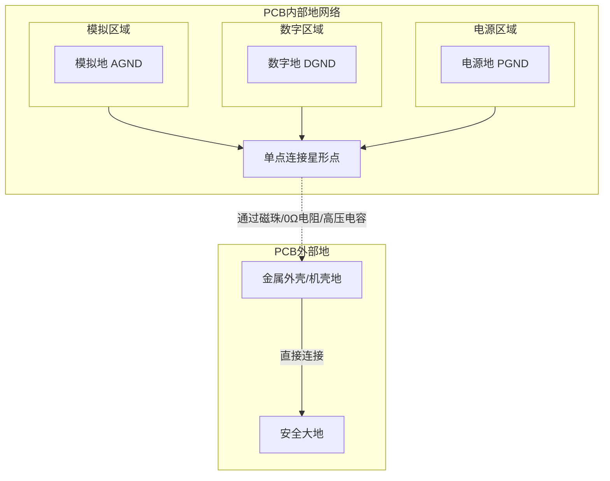

# PCB设计中GND是什么

### 一、核心定义：GND不是“地”，而是参考点

**在PCB设计和电子学中，GND（地）的首要定义不是指“大地”或“地球”，而是指电路的公共参考点（Common Reference Point）或返回路径（Return Path）。**

所有电压的测量都是相对的。当我们说“某点电压是5V”时，潜台词是“该点相对于GND参考点的电压是5V”。GND被定义为零电位（0V）的基准，其他所有节点的电压都是相对于它来测量的。

---

### 二、GND在PCB中的关键作用

1.  **电压参考（Voltage Reference）**：
    为所有芯片和元器件提供一个稳定的、统一的0V基准，确保大家對“高电平”和“低电平”的判断标准一致。

2.  **信号返回路径（Signal Return Path）**：
    电流必须形成一个闭环才能流动。当信号从芯片A发送到芯片B时，电流沿着信号线流出，**必须通过GND网络（通常是地平面）流回源头**。忘记返回路径是初学者最常见的错误之一。

3.  **电源返回路径（Power Return Path）**：
    为电源电流提供返回电源地的路径。所有从电源源（如电源芯片）流出的电流，最终都要通过GND网络流回电源的负极。

4.  **屏蔽与抗干扰（Shielding and Noise Immunity）**：
    一个完整的地平面可以充当“ shield”，吸收和转移电磁干扰（EMI），减少噪声对敏感信号的影响。高频信号的返回电流会紧贴在信号线下方的地平面上流动，形成最小的回流环路，从而降低辐射和阻抗。

### 三、PCB中GND的常见类型及处理方式

虽然都叫GND，但在复杂的系统中，它们可能承担不同的角色。正确处理它们之间的关系是PCB设计成败的关键。

| 类型 | 英文名 | 符号 | 作用 | PCB处理方式 |
| :--- | :--- | :--- | :--- | :--- |
| **信号地** | Signal Ground | SGND | 为数字或模拟信号提供干净的参考和返回路径。 | **通常是最主要的地平面。** 优先保证其完整性。 |
| **模拟地** | Analog Ground | AGND | 用于模拟电路部分（如传感器、ADC、放大器），对噪声极其敏感。 | 通常与数字地分开布线，最后在**一点**（通常在下图星形点或ADC下方）用磁珠或0欧电阻连接，防止数字噪声污染模拟信号。 |
| **数字地** | Digital Ground | DGND | 用于数字电路部分（如CPU、逻辑门），开关噪声很大。 | 与模拟地分离。数字器件应尽量放在数字地区域，电源去耦电容至关重要。 |
| **电源地** | Power Ground | PGND | 用于大电流的电源电路（如DC-DC转换器、电机驱动）。电流大，噪声剧烈。 | 通常单独布线，最后再与其他地连接。走线要宽，避免噪声耦合到敏感的信号地。 |
| **机壳地** | Chassis Ground | CGND | 连接金属外壳，主要目的是**安全屏蔽**和**释放静电**（ESD）。 | 通常通过一个高压电容（如100pF/2KV）和/或兆欧级电阻与信号地连接，提供高频噪声释放路径的同时，隔离安全地压差。**绝对不能直接与信号地短路！** |
| **大地** | Earth | | 真正接入大地的线，用于**安全保护**，防止触电。 | 通常通过三孔插座连接到设备的金属外壳（机壳地）。 |

**不同类型地的连接策略示意图：**

### 四、PCB设计中的GND处理原则

1.  **优先使用地平面（Ground Plane）**：
    *   对于双面板及以上，**务必使用一个完整、大面积的铜皮层作为地平面**。这是提高信号完整性、降低EMI最简单有效的方法。
    *   返回电流会自动选择阻抗最低的路径（即信号线下方的路径），从而形成最小环路面积。

2.  **保证返回路径畅通**：
    *   布线时就要思考：“电流从源头流出后，如何返回到GND？” 避免在地平面上挖出过多的沟壑（Split），否则会迫使返回电流绕远路，形成巨大环路天线，产生辐射和噪声。

3.  **单点连接（Star Point）**：
    *   对于不同的地（如AGND和DGND），通常采用“单点连接”的方式，将噪声电流的路径控制在一点，防止相互干扰。

4.  **多点接地 vs 单点接地**：
    *   **低频电路（<1MHz）**：适用单点接地，防止地线公共阻抗产生耦合。
    *   **高频电路（>10MHz）**：**必须使用大面积地平面（即多点接地）**。因为返回电感成为主要问题，地平面可以提供低电感路径。此时单点接地反而会因为长走线产生巨大天线效应。

5.  **减小环路面积**：
    *   信号线和它的地返回路径所包围的面积要尽可能小。环路面积越大，天线效应越强，越容易辐射和接收噪声。这就是高速信号要紧靠地平面走线的原因。

### 总结与比喻

*   **GND是电路的“海平面”**：所有电压测量都是相对于这个海平面的“海拔高度”。
*   **GND是电流的“海洋”**：所有流出的电流，最终都要汇入这片海洋回到源头。
*   **糟糕的GND设计**：就像交通系统没有规划好回家的路，车流（电流）会到处乱窜，造成拥堵和事故（噪声和干扰）。
*   **优秀的GND设计**：就像一个规划了高速路网和清晰交通指示的系统，车流（电流）可以高效、安静地返回。

因此，在PCB设计中，**“如何布线”固然重要，但“如何布地”往往更能体现一个工程师的水平**。永远要优先考虑你的地返回路径。