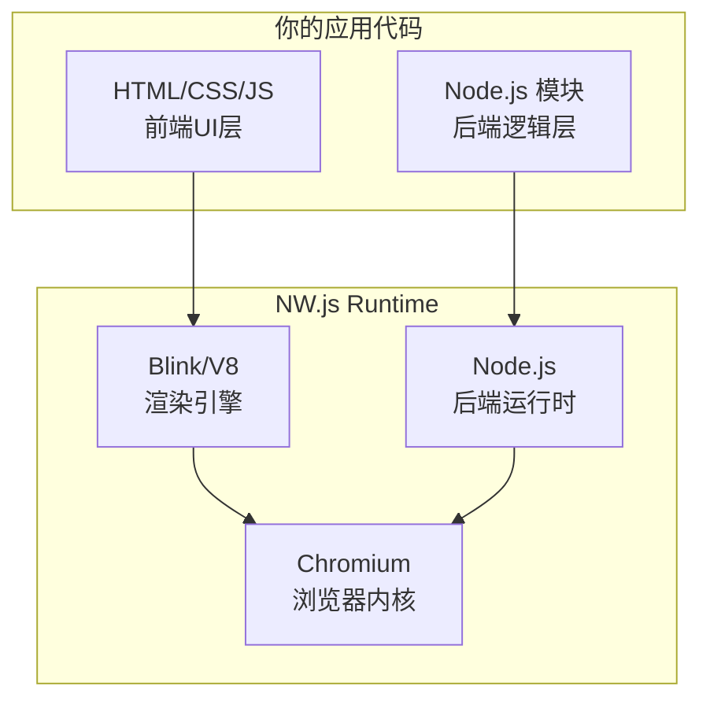
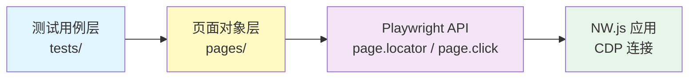
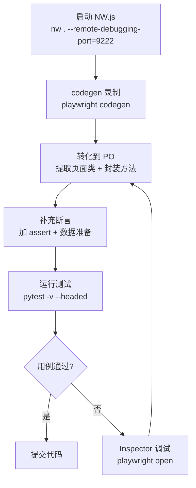
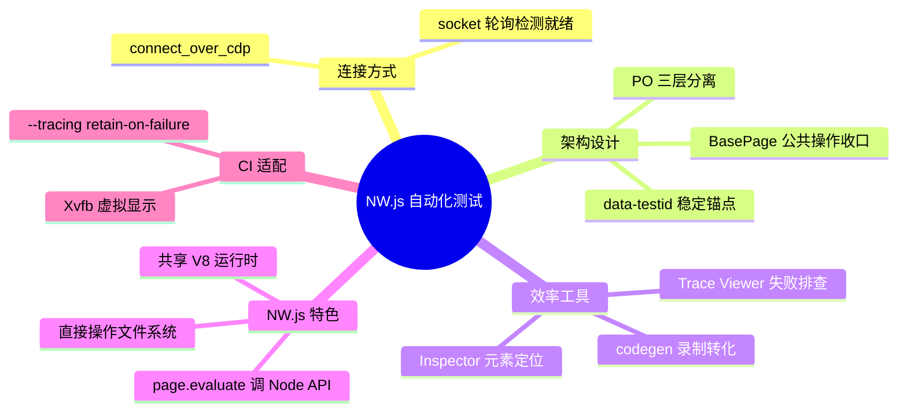

# NW.js 桌面应用自动化测试：当 Chromium 套壳遇上 Playwright

## 前言

公司有个基于 NW.js 的桌面客户端项目，最近需求密集迭代，每次发版前台开发小哥都吐槽回归测试点到手抽筋。Leader 找到我："这个项目你来搞一下自动化。"

我打开项目一看：NW.js，Chromium 内核。当时心里就稳了一半——这玩意儿本质上就是个浏览器，Playwright 天生就会操作浏览器。剩下的问题无非是：怎么让 Playwright 认出它是"自己人"，以及怎么把自动化代码写得像个人样。

事实证明，**第一件事用 `connect_over_cdp` 一行搞定，第二件事就得靠 PO 设计模式撑场面了**。

本文将完整记录从零搭建 NW.js + pytest + Playwright 自动化测试体系的全过程——从环境选型、PO 架构设计、Fixture 管理，到脚本录制和元素拾取。文中的每段代码都是实际落地跑过的，不是 demo 唬人的。

---

## 一、NW.js 速览：被测对象长什么样

在动刀写测试之前，得先搞清楚你要测的是个什么物种。

NW.js（原名 node-webkit）是一个把 **Chromium** 和 **Node.js** 揉在一起的桌面应用运行时，架构如下：



关键特征及其对自动化测试的影响：

| 特征 | 含义 | 对测试的影响 |
|------|------|------------|
| 渲染进程直接调 Node API | `<script>` 里能 `require('fs')` | `page.evaluate` 可以直接操作文件系统 |
| 单进程为主 | JS 和 Node 在同一 V8 实例 | 不需要 IPC，测试断言更直接 |
| 基于 Chromium | 完整内核，包括 DevTools | **Playwright 可以通过 CDP 连接它** |
| `--remote-debugging-port` | 支持 Chromium 原生调试标志 | 这是整个测试方案的基石 |

最关键的认知：凡是基于 Chromium 的东西，开一个 CDP 端口，Playwright 就能挂上去。NW.js、Electron、CEF —— 范式相同。你不是在测一个"桌面应用"，你是在测一个"带 Node.js 后门"的 Chrome 页面。

---

## 二、方案选型：为什么是 Playwright

自动化测试工程师的第一课：选错工具，后面全是技术债。

桌面应用自动化的候选方案横向对比：

| 方案 | 原理 | 能否搞定 NW.js | 门槛 | 维护成本 | 结论 |
|------|------|:--:|:--:|:--:|------|
| **Playwright** | CDP 协议 | ✅ 原生支持 | 低 | 低 | **就它了** |
| Selenium + ChromeDriver | WebDriver 协议 | ⚠️ 需折腾 | 中 | 中 | 启动慢、API 啰嗦 |
| Puppeteer | CDP 协议 | ✅ 能行 | 中 | 中 | JS 生态，团队技术栈不匹配 |
| PyAutoGUI / SikuliX | 图像识别 + 系统级点击 | ⚠️ 勉强 | 低 | 极高 | 换个分辨率就崩，不可靠 |
| NW.js 自带测试 | NW.js API | ✅ 官方 | 低 | 高 | 功能贫瘠，无生态 |

选 Playwright 的理由非常务实：

1. **原生 CDP 支持** — `connect_over_cdp()` 一行代码连上 NW.js，比 Electron 的 `electron.launch()` 还清爽
2. **自动等待** — 不用 `time.sleep(3)` 满天飞，这是 Selenium 用户迁移过来的第一幸福感来源
3. **Codegen 录制** — 新人上手不用硬背 API，点一点就出代码
4. **pytest 插件** — `pytest-playwright` 开箱即用，Fixture 托管、截图、录像全内置
5. **Python 生态** — 自动化团队标配 Python，零学习成本

---

## 三、环境搭建：让 NW.js 开口说 CDP

### 3.1 安装依赖

```bash
pip install pytest pytest-playwright
playwright install chromium
```

`playwright install chromium` 会下载一个独立的 Chromium。虽然我们不直接用 Playwright 启动 NW.js，但驱动层依赖它来获取 CDP 协议实现。

### 3.2 让 NW.js 开启调试端口

NW.js 需要在启动时打开 CDP 监听。跟开发同学打个招呼，加一行配置即可。

**方式一：package.json 配置（推荐，一劳永逸）**

```json
{
  "name": "my-nwjs-app",
  "main": "index.html",
  "chromium-args": "--remote-debugging-port=9222"
}
```

**方式二：命令行传参（临时调试用）**

```bash
nw . --remote-debugging-port=9222
```

### 3.3 验证 CDP 是否就绪

启动 NW.js 后，浏览器访问 `http://localhost:9222/json`：

```json
[
  {
    "id": "ABC123...",
    "title": "My NW.js App",
    "type": "page",
    "url": "file:///C:/path/to/index.html",
    "webSocketDebuggerUrl": "ws://localhost:9222/devtools/page/ABC123..."
  }
]
```

返回 JSON 说明 CDP 已就绪，Playwright 可以上场了。

> **坑点预警**：返回空数组或连接拒绝？三项自查：
> 1. NW.js 确实带 `--remote-debugging-port` 启动了吗
> 2. 端口被占了吗（`netstat -ano | findstr 9222`）
> 3. NW.js 的 Chromium 内核版本是否 >= 60（2017 年后的版本都没问题，但你永远不知道祖传项目用的什么古董）

---

## 四、Fixture 设计：企业级连接管理

项目目录结构先放出来，有个全局视角：

```
nwjs-autotest/
├── conftest.py           # Fixture：NW.js 生命周期管理
├── pages/                # PO：页面对象层
│   ├── __init__.py
│   ├── base_page.py      # 基类：封装通用操作
│   ├── login_page.py     # 登录页
│   ├── main_page.py      # 主页面
│   └── settings_page.py  # 设置页
├── tests/                # 测试用例层
│   ├── __init__.py
│   ├── test_login.py
│   └── test_main.py
├── data/                 # 测试数据
│   └── test_data.json
├── utils/                # 工具层
│   ├── __init__.py
│   └── nw_launcher.py    # NW.js 启动器
└── pytest.ini
```

分三层：**Fixture 层负责应用生命周期，Pages 层负责元素定位和操作封装，Tests 层只写业务逻辑**。各层各管各的，谁也不越界。

### 4.1 NW.js 启动器

先把 NW.js 的启动/停止逻辑抽出来，避免 conftest 膨胀：

```python
# utils/nw_launcher.py
import subprocess
import time
import socket


class NwLauncher:
    """NW.js 进程管理器 —— 管杀管埋"""

    def __init__(self, nw_path: str, app_dir: str, cdp_port: int = 9222):
        self.nw_path = nw_path
        self.app_dir = app_dir
        self.cdp_host = "127.0.0.1"
        self.cdp_port = cdp_port
        self._proc = None

    def start(self, timeout: int = 30):
        """启动 NW.js 并等待 CDP 就绪"""
        self._proc = subprocess.Popen(
            [self.nw_path, self.app_dir, f"--remote-debugging-port={self.cdp_port}"],
            stdout=subprocess.DEVNULL,
            stderr=subprocess.DEVNULL,
        )
        self._wait_for_cdp(timeout)

    def stop(self):
        """优雅退出，必要时强杀"""
        if self._proc is None:
            return
        self._proc.terminate()
        try:
            self._proc.wait(timeout=10)
        except subprocess.TimeoutExpired:
            self._proc.kill()

    @property
    def cdp_url(self) -> str:
        return f"http://{self.cdp_host}:{self.cdp_port}"

    def _wait_for_cdp(self, timeout: int):
        deadline = time.time() + timeout
        while time.time() < deadline:
            if self._is_port_open():
                return
            time.sleep(0.5)
        self._proc.kill()
        raise RuntimeError(
            f"NW.js CDP 端口 {self.cdp_port} 在 {timeout}s 内未就绪"
        )

    def _is_port_open(self) -> bool:
        with socket.socket(socket.AF_INET, socket.SOCK_STREAM) as s:
            s.settimeout(1)
            return s.connect_ex((self.cdp_host, self.cdp_port)) == 0
```

### 4.2 conftest.py

```python
# conftest.py
import pytest
from playwright.sync_api import sync_playwright, Browser, Page
from utils.nw_launcher import NwLauncher

NW_EXECUTABLE = r"C:\path\to\nw.exe"
APP_DIR = r"C:\path\to\your\app"


@pytest.fixture(scope="session")
def nw_launcher():
    """Session 级别：启动一次，全局唯一"""
    launcher = NwLauncher(NW_EXECUTABLE, APP_DIR)
    launcher.start()
    yield launcher
    launcher.stop()


@pytest.fixture(scope="session")
def nw_browser(nw_launcher: NwLauncher) -> Browser:
    """Session 级别：通过 CDP 连接到 NW.js"""
    with sync_playwright() as p:
        browser = p.chromium.connect_over_cdp(nw_launcher.cdp_url)
        yield browser


@pytest.fixture(scope="function")
def page(nw_browser: Browser) -> Page:
    """每个测试用例独立的 page，互不污染"""
    if nw_browser.contexts:
        ctx = nw_browser.contexts[0]
        if ctx.pages:
            page = ctx.pages[0]
            page.bring_to_front()
            return page
    ctx = nw_browser.new_context()
    return ctx.new_page()
```

### 4.3 设计要点

| 设计决策 | 理由 |
|----------|------|
| `NwLauncher` 独立抽离 | 单一职责：conftest 只管依赖注入，启动逻辑归 launcher |
| `scope="session"` 启动 NW.js | 冷启动 3~5 秒，每个用例都重启 = 浪费生命 |
| socket 轮询替代 time.sleep | 不知道要等 2 秒还是 15 秒，那就等到它真的就绪为止 |
| `scope="function"` 的 page | 测试间不污染 cookie / localStorage / URL |
| try/except TimeoutExpired + kill | 僵尸进程比失败用例更可怕，它会默默吃掉端口 |

---

## 五、PO 设计模式：测试代码不是脚本，是工程

你肯定见过这种用例：

```python
# 别这么写
def test_login(page):
    page.locator("#username").fill("admin")
    page.locator("#password").fill("123456")
    page.locator("#login-btn").click()
    assert page.locator(".welcome-text").inner_text() == "欢迎"
```

这叫线性脚本，三个月后 `#login-btn` 改成了 `#submit-btn`，你就要在 47 个用例里逐个修改。这是自动化测试的第一大死法——**元素变更引发的维护雪崩**。

PO（Page Object）的核心思想一句话：**每个页面封装成一个类，元素定位和页面操作关在类里面。用例只调页面对象的方法，永远不直接碰 locator。**



### 5.1 基类：公共操作统一收口

```python
# pages/base_page.py
from playwright.sync_api import Page


class BasePage:
    """所有页面对象的基类 —— DRY 原则的第一道防线"""

    def __init__(self, page: Page):
        self.page = page

    def wait_visible(self, locator, timeout: int = 10000):
        """等待元素可见（所有页面都要用的操作，写一遍就够了）"""
        self.page.locator(locator).wait_for(state="visible", timeout=timeout)

    def click_by_testid(self, testid: str):
        self.page.get_by_test_id(testid).click()

    def fill_by_testid(self, testid: str, value: str):
        self.page.get_by_test_id(testid).fill(value)

    def get_text_by_testid(self, testid: str) -> str:
        return self.page.get_by_test_id(testid).inner_text()

    def get_title(self) -> str:
        return self.page.title()

    def screenshot(self, name: str):
        self.page.screenshot(path=f"screenshots/{name}.png", full_page=True)
```

### 5.2 具体页面类

```python
# pages/login_page.py
from pages.base_page import BasePage


class LoginPage(BasePage):
    """登录页 —— 元素定位只出现在这里，别处不认"""

    # ── Locators（集中管理，改起来只改这一处）──
    USERNAME_INPUT = "username-input"
    PASSWORD_INPUT = "password-input"
    LOGIN_BUTTON = "login-btn"
    ERROR_MESSAGE = "login-error"

    # ── Actions ──
    def navigate(self):
        """导航到登录页"""
        self.page.goto("file:///C:/path/to/login.html")

    def login(self, username: str, password: str):
        """执行登录操作 —— 用例只调这个方法，不需要知道内部怎么点的"""
        self.fill_by_testid(self.USERNAME_INPUT, username)
        self.fill_by_testid(self.PASSWORD_INPUT, password)
        self.click_by_testid(self.LOGIN_BUTTON)

    # ── Assertions（页面状态的断言方法，供用例直接调）──
    def get_error_message(self) -> str:
        return self.get_text_by_testid(self.ERROR_MESSAGE)

    def is_login_button_visible(self) -> bool:
        return self.page.get_by_test_id(self.LOGIN_BUTTON).is_visible()
```

```python
# pages/main_page.py
from pages.base_page import BasePage


class MainPage(BasePage):
    WELCOME_TEXT = "welcome-text"
    SETTINGS_LINK = "settings-link"
    PROJECT_LIST = "project-list"
    NEW_PROJECT_BTN = "new-project-btn"

    def get_welcome_message(self) -> str:
        return self.get_text_by_testid(self.WELCOME_TEXT)

    def go_to_settings(self):
        self.click_by_testid(self.SETTINGS_LINK)

    def create_new_project(self, project_name: str):
        self.click_by_testid(self.NEW_PROJECT_BTN)
        self.page.get_by_placeholder("项目名称").fill(project_name)
        self.page.get_by_role("button", name="确认").click()

    def get_project_count(self) -> int:
        items = self.page.get_by_test_id(self.PROJECT_LIST).locator("li")
        return items.count()
```

### 5.3 用例层：只写业务，不写 locator

有了 PO 之后，测试用例变得像自然语言：

```python
# tests/test_login.py
import pytest
from pages.login_page import LoginPage
from pages.main_page import MainPage


class TestLogin:
    """登录模块 —— 用例只描述业务场景"""

    def test_login_success(self, page):
        """正常登录：输入正确账号密码后进入主页"""
        login_page = LoginPage(page)
        login_page.navigate()
        login_page.login("admin", "password123")

        main_page = MainPage(page)
        main_page.wait_visible(main_page.WELCOME_TEXT)
        assert "欢迎" in main_page.get_welcome_message()

    def test_login_wrong_password(self, page):
        """错误密码：页面上显示错误提示"""
        login_page = LoginPage(page)
        login_page.navigate()
        login_page.login("admin", "wrong_password")

        assert "密码错误" in login_page.get_error_message()

    def test_login_empty_username(self, page):
        """空用户名：登录按钮不可点击"""
        login_page = LoginPage(page)
        login_page.navigate()
        login_page.login("", "password123")

        assert login_page.is_login_button_visible()
```

```python
# tests/test_main.py
from pages.login_page import LoginPage
from pages.main_page import MainPage


class TestMain:
    """主页面模块"""

    def test_create_project(self, page):
        """创建新项目后，项目列表数量增加"""
        login_page = LoginPage(page)
        login_page.navigate()
        login_page.login("admin", "password123")

        main_page = MainPage(page)
        before = main_page.get_project_count()
        main_page.create_new_project("自动化测试项目")
        main_page.wait_visible(main_page.PROJECT_LIST)
        after = main_page.get_project_count()

        assert after == before + 1
```

### 5.4 PO 的分层收益

```
用例改了业务逻辑 → 只改 tests/
UI 改了个元素定位 → 只改 pages/ 对应的那一个属性
加了通用操作       → 只改 base_page.py
换了被测环境       → 只改 conftest.py 的 NW_PATH
```

这就是分层的核心价值：**变更被隔离在最小范围内**。三个月后开发把 `#login-btn` 改成 `#submit-btn-v3-final`，你只需要改 `LoginPage.LOGIN_BUTTON` 一个变量，47 个用例纹丝不动。

---

## 六、NW.js 特色：测试中直接操刀 Node API

这是 NW.js 测试最特别的地方 —— `page.evaluate` 可以直接调用 Node API，因为渲染进程和 Node 运行在同一 V8 实例中。

```python
# pages/node_utils.py
"""封装通过 page.evaluate 调用的 Node 能力"""


class NodeUtils:
    def __init__(self, page):
        self.page = page

    def read_file(self, filepath: str) -> str:
        """直接读取本地文件 —— 测试数据准备的神器"""
        return self.page.evaluate("""
            (path) => {
                const fs = require('fs');
                return fs.readFileSync(path, 'utf-8');
            }
        """, filepath)

    def write_file(self, filepath: str, content: str):
        """直接写本地文件 —— 环境清理和 Mock 数据注入"""
        self.page.evaluate("""
            ([path, data]) => {
                const fs = require('fs');
                fs.writeFileSync(path, data);
            }
        """, [filepath, content])

    def get_platform(self) -> str:
        """获取操作系统平台"""
        return self.page.evaluate("() => require('os').platform()")

    def file_exists(self, filepath: str) -> bool:
        return self.page.evaluate("""
            (path) => {
                const fs = require('fs');
                return fs.existsSync(path);
            }
        """, filepath)
```

在用例中使用：

```python
def test_config_import(page):
    """验证导入配置文件的功能"""
    from pages.node_utils import NodeUtils

    node = NodeUtils(page)
    # 用 Node API 写入一份测试配置
    node.write_file("/tmp/test_config.json", '{"theme":"dark"}')

    # 触发应用的导入功能
    page.get_by_test_id("import-config-btn").click()
    page.get_by_test_id("config-path-input").fill("/tmp/test_config.json")
    page.get_by_text("加载").click()

    # 断言
    page.get_by_text("主题: dark").wait_for()
```

> 这在 Electron 的 `contextIsolation: true` 模式下是不敢想的——在那里你得走 preload + IPC 绕一大圈。NW.js 在这方面倒是开了个"后门"，让自动化测试事半功倍。

---

## 七、录制脚本与元素拾取

### 7.1 codegen 录制

这是降低用例编写门槛的核武器：

```bash
# 终端1：启动 NW.js（带 CDP）
nw . --remote-debugging-port=9222

# 终端2：codegen 连上去录制
playwright codegen --target python-pytest http://localhost:9222
```

之后在 NW.js 窗口中的所有操作——点击、填充文本、拖拽——都会被实时转换成 Python 代码。常用参数：

```bash
# 指定输出文件 + 视口 + 保存登录态
playwright codegen \
  --target python-pytest \
  --output test_generated.py \
  --viewport-size=1280,720 \
  --save-storage=auth.json \
  http://localhost:9222
```

### 7.2 录制 → PO 的转化流程

codegen 生成的代码是线性脚本，不能直接进仓库。转化步骤：

1. **录制原始流程**：拿到 locator 和操作序列
2. **提取页面类**：把 locator 归类到对应的 Page 类中
3. **封装操作为方法**：连续的 UI 操作组合成业务方法（如 `login(user, pwd)`）
4. **替换原始 locator**：将 codegen 生成的 CSS 选择器替换为 `data-testid`
5. **补充断言**：录制只管点，不管验证，断言得自己加

录出来的原始代码：

```python
# codegen 输出（原始）
page.locator("#username").fill("admin")
page.locator("#password").fill("123456")
page.locator("#login-btn").click()
```

转化后：

```python
# 进 PO 的方法
def login(self, username: str, password: str):
    self.fill_by_testid(self.USERNAME_INPUT, username)
    self.fill_by_testid(self.PASSWORD_INPUT, password)
    self.click_by_testid(self.LOGIN_BUTTON)
```

### 7.3 Playwright Inspector — 元素定位军械库

```bash
playwright open http://localhost:9222
```

Inspector 三大核心能力：

- **Explore（瞄准镜图标）**：悬停元素自动高亮并推荐最佳 locator，点击复制到剪贴板
- **Step-through 调试**：逐步执行代码，实时看每步效果
- **Locator 验证**：输入表达式立刻显示匹配了几个元素

### 7.4 Locator 优先级

在 PO 里写 locator 时，按这个优先级选：

| 优先级 | Locator | 示例 | 稳定性 |
|--------|---------|------|:------:|
| 1 | `data-testid` | `self.page.get_by_test_id("submit-btn")` | ★★★★★ |
| 2 | `role` + `name` | `self.page.get_by_role("button", name="提交")` | ★★★★☆ |
| 3 | `placeholder` / `label` | `self.page.get_by_label("用户名")` | ★★★★☆ |
| 4 | `text` | `self.page.get_by_text("确认删除")` | ★★★☆☆ |
| 5 | CSS / XPath | `self.page.locator("#app > div > button:nth-child(3)")` | ★☆☆☆☆ |

给开发同学提需求时直接说：**"关键交互元素加个 `data-testid`，不用写逻辑，纯属性，对你们零影响，对我们救命。"** 这句话通常管用。

---

## 八、完整工作流

把录、写、跑串成一条流水线：



```bash
# Step 1: 启动 NW.js
nw . --remote-debugging-port=9222 &

# Step 2: 录制新场景
playwright codegen --target python-pytest -o test_draft.py http://localhost:9222

# Step 3: 转化到 PO（人工）
# - 在 pages/ 下新建或补充页面类
# - 在 tests/ 下写用例，只调 PO 方法

# Step 4: 运行
pytest tests/test_new_feature.py -v --headed --screenshot only-on-failure

# Step 5: CI（Linux 容器）
xvfb-run pytest tests/ -v --screenshot only-on-failure
```

### CI 环境适配

NW.js 是 GUI 应用，Linux CI 容器里需要 Xvfb（虚拟帧缓冲）。已在工场环境的 Docker 镜像中验证通过：

```dockerfile
# CI Dockerfile 片段
RUN apt-get update && apt-get install -y xvfb libnss3 libatk-bridge2.0-0 \
    libdrm2 libxkbcommon0 libgbm1 libasound2
```

```bash
# CI 执行脚本
xvfb-run --auto-servernum --server-args="-screen 0 1920x1080x24" \
  pytest tests/ -v --screenshot only-on-failure --tracing retain-on-failure
```

`--tracing retain-on-failure` 是 CI 必加参数：只保留失败用例的 Trace，成功的不占磁盘。Trace 文件用 `playwright show-trace trace.zip` 打开，每一步操作的截图、DOM 快照、网络请求全在里面。

---

## 九、常见问题速查

| 问题 | 症状 | 根因 | 解法 |
|------|------|------|------|
| CDP 连接拒绝 | `ConnectionRefusedError` | NW.js 没带调试端口启动 | 检查 `chromium-args` 配置 |
| 端口就绪但无页面 | `browser.contexts` 为空 | HTML 还在加载中 | `_wait_for_cdp` 后加 `page.wait_for_load_state("networkidle")` |
| 元素找不到 | `TimeoutError` | Locator 变更 / 页面未渲染完 | 换 data-testid；确认操作的 context 正确 |
| evaluate 报 require 不存在 | `ReferenceError` | page 不在 Node Context | 检查是否创建了不带 nodeIntegration 的 context |
| CI 能过本地不过 | 环境差异 | 分辨率、字体、残留数据 | 锁死 Viewport；每个用例自备数据 |
| NW.js 僵尸进程 | 测试结束 nw.exe 还在 | 用例 crash 导致 terminate 没执行 | `NwLauncher.stop()` 加 kill 兜底 |

---

## 十、总结



三条核心认知：

1. **NW.js = Chromium → CDP → Playwright。** 这条链是全部工作的基石。别被"桌面应用"四个字吓住——对测试来说它就是个浏览器。
2. **PO 不是设计模式的炫技，是维护性的保险。** 47 个用例里散落同一个 locator，改起来就是灾难。收口到页面类的属性里，改一处全生效。
3. **`data-testid` 花 10 分钟，省 100 小时。** 跟开发达成共识，关键交互元素加 testid。这是你们之间最划算的默契。

| 环节 | 工具/模式 | 关键决策 |
|------|---------|---------|
| 连接方式 | `connect_over_cdp` | 不替 NW.js 启动，只连接已运行的 |
| 架构 | Page Object 三层分离 | BasePage / Pages / Tests 各司其职 |
| 端口检测 | socket 轮询 | 替代盲等，精确知道何时就绪 |
| 用例编写 | codegen 录制 → PO 转化 | 效率与工程化的平衡 |
| 元素定位 | Inspector + data-testid | 从"找得到"进化到"永远找得到" |
| Node API | page.evaluate | 测试中直接读写文件系统 |
| CI | Xvfb（Linux） | 无头环境跑 GUI 应用 |

---

**最后说一句：如果你还在给 NW.js 应用做手工回归测试，Playwright 加上 PO 架构，就是你的自动化答案。鼠标和手指都会感谢你。**

---

## 附录：依赖版本参考

| 组件 | 推荐版本 | 说明 |
|------|---------|------|
| Python | 3.10+ | Playwright 最低 3.8，3.10+ 类型提示更完善 |
| pytest | 8.x | 测试框架 |
| pytest-playwright | 0.5+ | pytest 集成插件 |
| playwright | 1.50+ | 核心库 |
| NW.js | 0.70+ | 确保 Chromium 内核 >= 100 |
