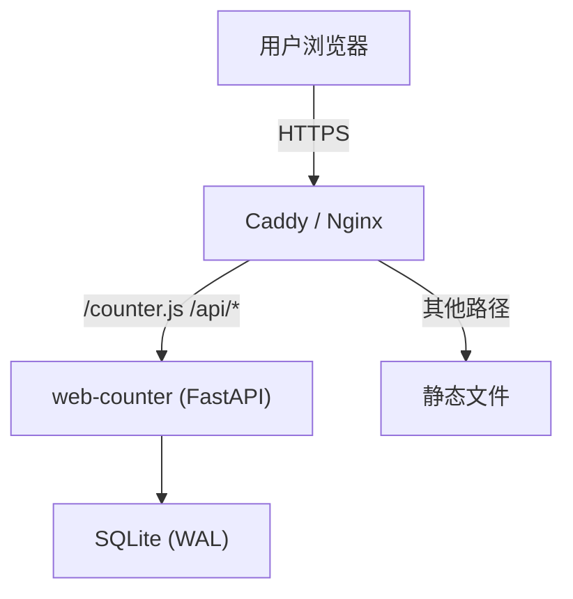
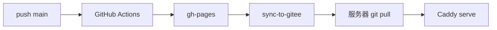

# 我花了三天时间写了一个网站计数器，然后把它开源了


## 起因

我的个人站点 [mikigo.site](https://mikigo.site) 是用 Rspress 搭的静态博客。纯静态，没有后端。

这就意味着我不知道谁来看过、哪篇文章最受欢迎。Google Analytics 实在太重了——一个脚本 100KB，还得弹 Cookie 弹窗。对一个技术博客来说，为看个 PV 让用户点"同意追踪"？不太对劲。

不蒜子够轻量，但服务是别人的。哪天说不蒜就不蒜了，数据也跟着没了。

于是我决定自己写一个。

https://github.com/mikigo/web-counter


## 选型

需求很简单：记录访问、查询统计、展示数据。给自己定的规矩也很简单：

1. 依赖能少就少
2. 不需要 MySQL、Redis 这些，一个 SQLite 搞定
3. 用户 `pip install && web-counter start` 就能跑

| 层 | 选择 | 理由 |
|---|------|------|
| Web 框架 | FastAPI + uvicorn | BackgroundTasks 天然适合异步写库 |
| 数据库 | SQLite WAL + aiosqlite | 单文件零运维，WAL 撑得住并发 |
| 密码哈希 | bcrypt | Dashboard 管理员密码，没什么好纠结的 |
| 前端 JS | 原生 JS，约 1KB | 没引入任何框架 |
| 图表 | Chart.js CDN | Dashboard 看板用，走 CDN 不占包体积 |
| 进程管理 | systemd + PID 文件 | start / stop / restart 一套走 |
| 分发 | pip 包 | Python 项目标配 |

前端 counter.js 用原生 XMLHttpRequest 发两个请求，剩下的交给 DOM。没有 React、没有 Webpack、没有 node_modules 黑洞。


## 架构



几个有意思的设计决策：

**API 地址自动发现。** counter.js 通过 `document.currentScript.src` 反推 API 基地址，同域部署不用配。如果你把 JS 放 CDN 上，加个 `data-counter-api` 属性就行。

**声明式 DOM 绑定。** 用户写 `<span data-pv-today></span>`，counter.js 自动扫 data-* 属性填数据。计数器初始 `display:none`，数据到了才显示。后端挂了用户完全无感——这是我最满意的设计。

**隐私去重不用 Cookie。** 不存 IP、不设 Cookie、不做指纹。访客唯一性 = `SHA256(IP + salt)`，salt 你自己生成自己保管。换 salt 意味着历史 UV 归零，所以文档里写了三遍"salt 设定后不要换"。

## counter.js：1KB 能干多少事

```javascript
(function () {
  // 1. 发现 API 地址
  var apiBase = scriptTag.src.substring(0, scriptTag.src.lastIndexOf("/"));

  // 2. 扫描 DOM
  var pvToday = document.querySelector("[data-pv-today]");

  // 3. 发请求，填数据，完事儿
  xhr.open("GET", apiBase + "/api/count");
  xhr.onload = function() {
    pvToday.textContent = JSON.parse(xhr.responseText).today_pv;
    container.style.display = "inline-block";
  };
})();
```

核心就这三步。其他的是千分位格式化、四种展示风格（badge / card / bordered / default）、SPA 路由适配、多容器可见性处理。展示风格纯内联 CSS，没有额外样式文件：

| 风格 | 效果 |
|------|------|
| `badge` | 圆角药丸徽章 |
| `card` | 白底卡片 + 阴影 |
| `bordered` | 细边框方框 |
| `default` | 纯文本 |

## 部署

服务器是 Ubuntu 22.04，Web 服务器用的 Caddy。

**systemd 服务：**

```ini
[Service]
Type=simple
Environment="COUNTER_SALT=<密钥>"
Environment="COUNTER_HOST=127.0.0.1"
Environment="COUNTER_PORT=8001"
ExecStart=python3 -m uvicorn web_counter.main:app --host 127.0.0.1 --port 8001
Restart=on-failure
```

绑 127.0.0.1，不直接暴露公网。

**Caddy 反代：**

```
mikigo.site, www.mikigo.site {
    handle /counter.js { reverse_proxy 127.0.0.1:8001 }
    handle /api/*      { reverse_proxy 127.0.0.1:8001 }
    handle /dashboard  { reverse_proxy 127.0.0.1:8001 }
    root * /var/www/mikigo.site
    file_server
}
```

同域部署，CORS 根本不配，省事。

**自动更新流水线：**



## Dashboard

`/dashboard` 登录后能看到：

- 今日 PV/UV、累计 PV/UV，每 30 秒自动刷新
- 30 天趋势图（Chart.js 双线对比）
- 排行榜管理（显示数量、排除规则，支持 `*` 通配符）
- 数据重置、起始值设置

密码 bcrypt 哈希，session cookie 设了 HttpOnly + SameSite=Lax，24 小时过期。

## 集成 Skill

开发过程中在 Rspress 和 VitePress 上踩了不少坑。我把这些坑整理成了两个集成指南，放在项目 `skills/` 目录下：

| Skill | 适用框架 |
|-------|---------|
| `rspress-web-counter` | Rspress |
| `vitepress-web-counter` | VitePress |

里面记录了每个框架特有的坑——比如 Rspress head 配置里 `async:true` 会被序列化成 `asyncsrc`，JSX 里 `<span data-pv-page>` 会渲染成 `data-pv-page="true"`。如果你也用这些框架，直接看 Skill 能省不少时间。

## 踩过的 8 个坑

三天写完、测完、部署上线。不是一帆风顺，以下是印象最深的。

**1. Rspress head 布尔属性粘连**

`['script', { async: true, src: '/counter.js' }]` 被 Rspress 渲染成 `<script asyncsrc="/counter.js">`。`async` 和 `src` 粘在一起了，浏览器不认。去掉了 `async: true` 就好了。

**2. React 属性值陷阱**

`<span data-pv-page></span>` 在 JSX 里会变成 `data-pv-page="true"`，counter.js 把 `"true"` 当成页面路径去查，阅读量永远对不上。写成 `<span data-pv-page=""></span>`（空字符串）才正常。

**3. SPA 路由切换计数器没了**

Rspress 切换页面时 footer 重新渲染成 `display:none`，但浏览器不会重新执行 script 标签。加了 MutationObserver 监听 DOM 变化，自动重新填充。

**4. 刷一次 +2**

DOMContentLoaded 触发一次 `refresh()`，MutationObserver 又触发一次。加了 800ms 冷却和路径去重。

**5. 首次访问显示 0**

visit 和 count 请求同时发出去，visit 异步写库还没 commit，count 就查回来了。改成先发 visit，等它完成再查 count。

**6. 两个容器只显示一个**

页面同时有 footer 统计和文章阅读量两个 counter-container，早期代码只处理了第一个。改成遍历所有 counter 元素。

**7. 排行榜只显示 URL**

新页面没有 title 数据。让 counter.js 上报时顺便带 `document.title`，服务端存到 `page_titles` 表，顺便写了个脚本从 HTML 文件批量提取标题补历史数据。

**8. Rspress footer 只在首页**

`themeConfig.footer.message` 在 Rspress 里只在首页渲染。全站统计放 footer 里（首页可见），页面阅读量放 `beforeDocContent` 插槽里（文章页可见）。

## 开源

web-counter 已开源在 [GitHub](https://github.com/mikigo/web-counter)，PyPI 直接装：

```bash
pip install web-counter
```

如果你是静态博客用户，又在为访问统计发愁，试试这个。一行命令部署，一行标签接入，数据在你自己的服务器上。

欢迎 Star、Issue、PR。
