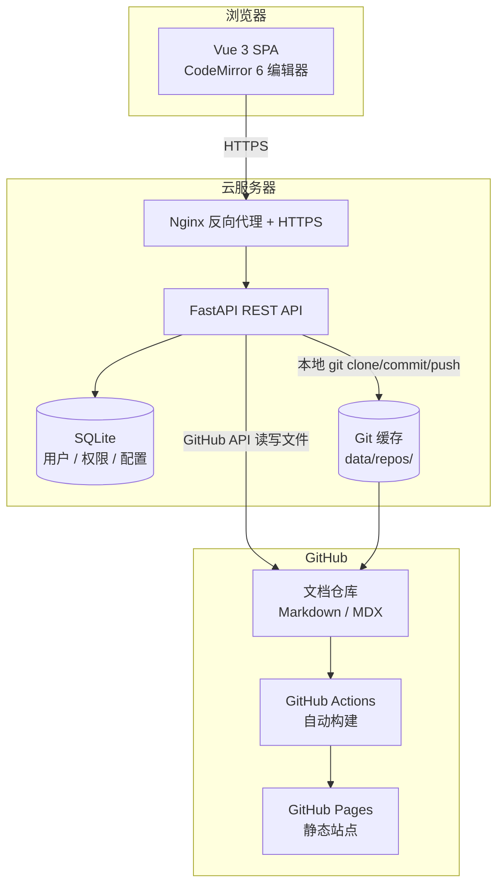

# 同事说"改个文档还要装 Git？算了我还是不写了"


## 缘起

两周前，一位做硬件 Layout 的同事在群里说 sailwind_docs 上某页文档有个接口名写错了。

我说那你直接改一下呗，仓库就在 GitHub 上，找到文件改完提个 PR 就行。

他沉默了几秒，回了句："要装 Git 是吧？……那算了，你帮我改一下吧。"

这哥们不是不愿意贡献。他只是不想为了改一行文字去学一套版本控制工具——这完全合理。一个 PCB 设计师，为什么要了解 `git clone`、`commit`、`push` 这些概念？

但这件事让我有点难受。他的专业知识和反馈本来可以让文档变得更好，就因为工具的门槛被挡在了外面。而且不只是他——团队里多数人碰不到代码层，但文档和他们每个人都相关。

我需要一个东西，让改文档像改在线文档一样简单：打开浏览器、找到文件、编辑、保存。至于背后怎么操作 Git，跟他们没关系。

扫了一圈现有的方案，都不太对味。Headless CMS 要么太重——MySQL + Redis + 对象存储全家桶，要么把文档内容存自己数据库里，Git 仓库成了二等公民。我已经有一套 Rspress + GitHub Actions + GitHub Pages 的构建流水线，不想被 CMS 绑架。

方向很明确：**Git 是唯一数据源，CMS 只做编辑这件事，不存文档内容。**

## 选型

| 层 | 选择 | 理由 |
|---|------|------|
| Web 框架 | FastAPI + uvicorn | 异步，httpx 调 GitHub API 不用阻塞 |
| ORM | Tortoise-ORM + aiosqlite | 异步 SQLite，类 Django 语法 |
| 认证 | JWT + bcrypt | 无状态，不需要 session 表 |
| 加密 | AES-256-CBC | 加密存 GitHub Access Token |
| 编辑器 | CodeMirror 6 | 模块化，按需加载 Markdown 扩展 |
| UI | Naive UI | Vue 3 组件库，DataTable、Modal、Form 开箱即用 |
| Markdown 渲染 | markdown-it | 轻量，经过十年验证 |
| Git 操作 | httpx（远程）/ asyncio.subprocess（本地） | GitHub REST API / 本地 git 命令 |

数据库选 SQLite 这件事值得展开说一句。文档 CMS 的数据库不存文档——文档在 Git 仓库里。数据库只管用户、角色、仓库配置这些元数据，行数加起来可能不过百。SQLite 单文件、零配置、备份就是一条 `cp`，在这个场景下比 PostgreSQL 务实得多。

## 架构



整条链路里 RepoPress 做了什么？把文件内容从 GitHub 拉下来，展示在编辑器里，用户改完点保存，再推回 GitHub。仅此而已。它不存储任何文档内容——Git 仓库始终是唯一真相来源。

## 几个设计决策

### "保存"按钮背后发生了什么

用户点保存，后端做的事和你在终端里做的完全一样：

```
git fetch → git rebase origin/main → 写入文件 → git add → git commit → git push
```

先 rebase 再写文件这个顺序是刻意的。如果两个人同时改同一个文件，后保存的人在 rebase 阶段会碰到远程的新提交，冲突自然暴露出来——不需要额外的锁机制。

### 直接推还是走 PR

大多数内部协作场景，改了直接推就行。但如果需要 Code Review——比如外部贡献者修改核心文档——可以切到 PR 模式：自动建分支、提交、创建 Pull Request。一个开关的事。

### 不用 Monaco，用 CodeMirror 6

Monaco 是 VS Code 的编辑器内核，功能齐全但体积大。CodeMirror 6 是模块化的——你想要什么扩展就加什么。Markdown 语法高亮、自动补全、搜索、历史、自定义 keymap（`Ctrl+S` 映射到保存），刚好够用，不多不少。

编辑器顶部放了一个 Toolbar：加粗、斜体、标题、链接、图片、内联代码、代码块、列表、引用。对熟悉 Markdown 的人来说可能多余，但对我那位 Layout 同事来说，这 9 个按钮就是他能参与进来的全部理由。

### 三面板 + 状态持久化

侧边栏 | 编辑器 | 预览，分隔条可以拖拽。展开状态、最后打开的文件、未保存的内容，全部存 localStorage。刷新页面回到离开时的状态——写代码的人不太在意这个功能，但非技术用户会挺需要。

### 不绑定文档框架

Rspress、VitePress、Docusaurus、MkDocs——RepoPress 不关心你用什么 SSG。只要配置里加一行 `editLink`，文档页右下角就会出现一个"在 RepoPress 上编辑此页"的链接：

```ts
editLink: {
    docRepoBaseUrl: 'https://editor.example.com/editor/<repo-id>/docs',
    text: '在 RepoPress 上编辑此页',
}
```

点进去直接对应当前页面的 Markdown 文件，所见即所得。

### Git Provider 抽象

说一个架构上的选择。后端对 Git 的操作抽了一个抽象基类，6 个方法：

```python
class GitProvider(ABC):
    async def get_file(self, path, ref) -> FileInfo
    async def create_or_update_file(self, path, content, message, branch) -> CommitResult
    async def create_branch(self, name, base) -> Branch
    async def create_pr(self, title, head, base, body) -> PullRequest
    async def get_file_history(self, path) -> list[Commit]
    async def get_tree(self, path, ref) -> list[TreeItem]
```

`GitHubProvider` 走 REST API，`LocalGitProvider` 走 subprocess 执行本地 git 命令。以后要支持 GitLab 或 Gitea，再写一个子类就行，不用动任何上层逻辑。

## 踩过的坑

**1. CodeMirror 和 Vue 3 的 ref 时序**

CodeMirror 初始化需要传入一个 DOM 节点。Vue 3 的 `ref` 在 `onMounted` 之前是 `null`，早一秒拿就炸。老老实实在 `onMounted` 里初始化，再用 `watch` 同步内容。

**2. git fetch 超时**

`asyncio.subprocess` 执行 git 命令，网不好的时候 `git fetch` 会一直卡住。设了一个 30 秒超时，超时就 kill。顺便加了 rebase 冲突的兜底——`rebase --abort`，不然仓库处于 rebase 中间状态，后续操作全废。

**3. 扁平列表变嵌套树**

GitHub API 返回的文件树是一维的——每个条目带完整路径，没有层级关系。但前端侧边栏需要一棵真正的树。要把 `['docs/guide/start.md', 'docs/api/auth.md', 'README.md']` 转成：

```json
[{
  "name": "docs",
  "children": [
    {"name": "guide", "children": [{"name": "start.md"}]},
    {"name": "api", "children": [{"name": "auth.md"}]}
  ]
}, {
  "name": "README.md"
}]
```

写了一个递归的 `_build_tree` 函数，按 `/` 拆路径，逐层插入。排序上目录优先、再字母序——不然文件混在目录中间，侧边栏没法看。

**4. 保存状态机**

保存流程是：点按钮 → 确认弹窗 → 请求 → loading → 结果。用户在 loading 期间如果强行关了弹窗再点保存，就会同时跑两个请求。解决方式很粗暴——保存期间按钮直接禁用，弹窗不给关。

**5. Mermaid 图表渲染的异步-同步冲突**

文档里经常有 Mermaid 图表。markdown-it 不认识 ` ```mermaid ` 代码块，需要在 fence 规则里拦截，用 mermaid 库渲染成 SVG 再插进 HTML。问题是 mermaid 是异步的，markdown-it 是同步的——只能先渲染完再整体替换。性能不是最优，但功能正常。

## 最后

[RepoPress](https://github.com/mikigo/RepoPress) 不是什么宏大的产品。它解决的问题很具体：让不想碰 Git 的人也能改文档。

那位 Layout 同事说"算了"的时候，我就觉得这件事不对劲。不是他的问题，是工具的问题。如果改一行文档需要在终端里敲三行命令，那大部分人都会选择沉默。但他们的沉默对我们来说是损失。

现在，他打开浏览器就能改了。希望这句话对你也成立。


