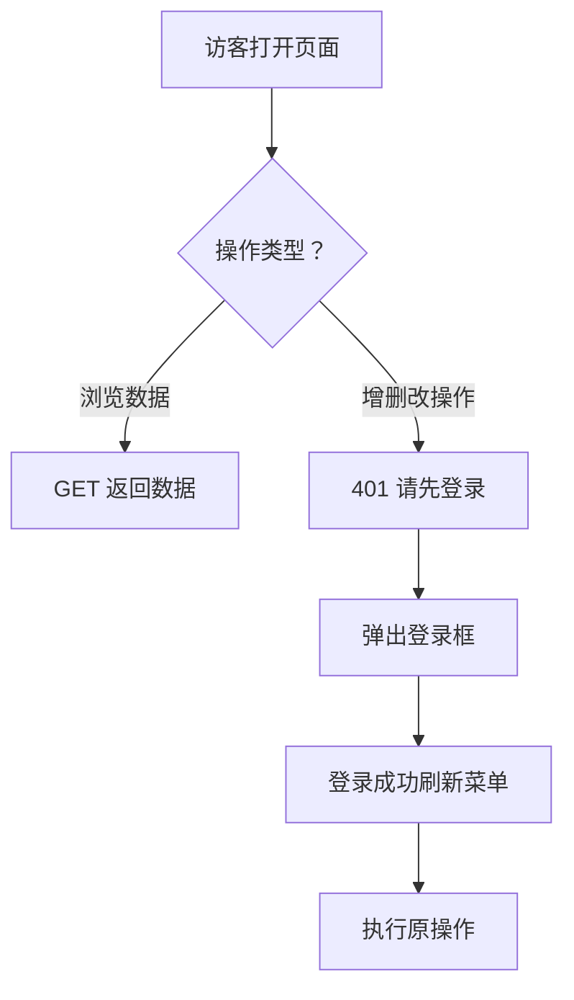

# 系统开门迎客，动手才验身

## 缘起

TestRunner 是一个测试任务管理平台。前两天我想把它部署到公网，方便团队随时随地查看自动化测试的执行情况。

然后我意识到一个问题：**每个人都要先注册、登录、分配角色才能看到测试报告。** 这就像你去一家餐厅，服务员挡在门口说"先填表办会员卡，不然不能看菜单"。

大部分人来这是想看测试结果的，不是来体验账号注册流程的。他们应该能自由浏览，只有需要创建、修改、删除数据的时候，系统才应该拦住说"等一下，你先证明你是谁"。

于是有了这次改造：**看，随便看；动手，先登录。**

## 方案

### 现状

TestRunner 的权限体系是标准的 RBAC：用户 → 角色 → API/菜单。每个请求进来，先查 JWT token 验身份，再查角色权限验资格。没有 token？直接 401，门都进不去。

要改成"随便看、动手验身"，核心就两件事：

1. **没 token 也能进门**——但不能裸奔，得穿个"访客"马甲
2. **GET 放行，POST/PUT/DELETE 拦截**——同一个门口，看人下菜

### 后端改什么

**AuthControl——token 变选修课。**

之前 `token: str = Header(...)`，三个点代表"不给就报错"。改成 `token: Optional[str] = Header(None)`，不给也行，给个匿名用户兜底：

```python
class AuthControl:
    @classmethod
    async def is_authed(cls, token: Optional[str] = Header(None)):
        if not token:
            user = await User.filter(username="anonymous").first()  # 没有？那就找个替身
            if user:
                CTX_USER_ID.set(int(user.id))
            return user  # 匿名用户也能进
        # 正常 token 逻辑不变
```

**PermissionControl——看人下菜。**

同一个权限检查方法，现在分两条路走：

```python
class PermissionControl:
    @classmethod
    async def has_permission(cls, request, current_user):
        # 匿名用户只读
        if current_user is None:
            if request.method == "GET":
                return        # 随便看
            raise HTTPException(status_code=401, detail="请先登录")  # 想动手？先验身

        # 已登录用户：正常 RBAC 检查
        # 但如果匿名用户想写 → 401 而不是 403
        if current_user.username == "anonymous" and request.method != "GET":
            raise HTTPException(status_code=401, detail="请先登录")
```

401 和 403 的区别很重要。403 是"我知道你是谁，但你没资格"，401 是"我还不知道你是谁，请先证明"。匿名用户走错门应该收到 401——前端收到后弹出登录框。而已登录用户权限不足收到 403——这叫"你没这个权限"，不是"你没登录"。

**种子数据——来访的都是客。**

系统初始化时自动创建一个特殊用户和角色：

| 种子数据 | 说明 |
|----------|------|
| `anonymous` 用户 | username=anonymous，没密码，不可能是超级管理员 |
| `访客` 角色 | 拥有所有菜单 + 所有 GET API 权限 |

访客角色能看什么，完全由后台配置控制。哪天你觉得某个接口不该给外人看了，把访客角色的 API 权限去掉就行。不需要改代码，不需要重启服务。

### 前端改什么

**路由守卫——撤销门禁。**

之前 `auth-guard.js` 的逻辑是"没 token？滚去登录页"。现在改成"没 token？请进"。

```javascript
// 之前：拦在门口
if (isNullOrWhitespace(token)) {
    if (WHITE_LIST.includes(to.path)) return true
    return { path: 'login', query: { redirect: to.path } }  // 强制登录
}

// 现在：来者不拒
if (isNullOrWhitespace(token)) {
    return true  // 请进，随便看
}
```

**动态路由——没人掉队。**

之前没 token 的时候 `addDynamicRoutes` 直接返回，动态菜单加载不到。现在不管有没有 token 都从后端拉菜单——匿名用户拿的是访客角色菜单，登录后刷新成自己的。

**Axios 拦截器——该拦才拦。**

之前 401 一律登出跳转。现在区分情况：

```
GET 请求 401 → 弹个 warning 提示，继续浏览
POST/PUT/DELETE 401 → 登出并跳转登录页
```

**头像 → 登录按钮。**

右上角：没登录显示"登录"按钮，登录后变成用户头像。

```vue
<UserAvatar v-if="userStore.userId"/>
<n-button v-else text @click="router.push('/login')">登录</n-button>
```

## 改造后的体验



一个真实的场景：运维同学打开 TestRunner，看一眼今天的测试报告，翻翻历史记录，全程不需要登录。当他发现某个测试用例需要更新参数时，点"编辑"，系统弹出登录框，扫码或输入密码，改完走人。这比先登录再浏览合理多了。

## 一些碎碎念

**RBAC 是提前验票，匿名访问是上了车再查票。** 各有各的适用场景。博物馆可以随便逛，但特展区要查票；机场要提前安检，但机场商店随便进。TestRunner 的定位更像博物馆——大部分东西是公共的，只有少数操作需要特权。

**改代码比改架构简单。** 整个改动 6 个文件，不到 100 行代码增量。没有引入新的数据库表、没有改路由结构、没有动业务逻辑。原因是复用了已有的 RBAC 基础设施——匿名用户就是一个普通用户，访客角色就是一个普通角色。PermissionControl 加了两行判断，整个系统的行为就变了。好的抽象确实省钱。

**前端也需要配合。** 后端改完只解决了一半问题。前端如果不把强制登录跳转去掉、不把 401 处理做区分、不把头像改成登录按钮，用户还是不知道该去哪里登录。前后端一起改，体验才是完整的。

**部署到公网，还有个前提值得单独说。** 用例名是产品路线图，失败堆栈里躺着内网路径，日志里可能有测试账号，截图可能是没发布的界面。这些都是 GET 能拿到的。访客角色的 API 权限可配置，在公网部署下从"灵活"变成了"必须"：哪些接口能见外人，事先得想清楚。

**大部分测试平台的 RBAC，是脚手架自带的，不是需求推导出来的。** 找个后台管理模板起项目，用户表、角色表、菜单权限表都给你配好了，于是你的平台"有了" RBAC。没人问过一句"我们 8 个人的测试组，为什么要 5 个角色"。默认值就这么成了架构决策。而 RBAC 真正的成本不在代码里，在运营上：新人开账号、人走了禁用、权限配错了排查、密码忘了重置。对一个内部工具，这些琐事攒一年，很可能比平台本身的开发量还大。

**"鉴权"这个词，把两件事糊在了一起。** 认证是"你是谁"，授权是"你能干嘛"。测试平台真正离不开的是前者。谁触发的任务、谁改的用例参数，出问题时我得能找到人问一句；任务会占测试机、烧真实资源，匿名触发大任务也得拦。这些事只要有身份就够了，不需要角色矩阵。自动化测试平台需要鉴权吗？需要身份，不需要门禁。

## 最后

TestRunner 本身不是什么大项目，但这个权限改造的思路对很多内部工具平台来说都适用——**大部分数据是公共资源，不应该被登录墙挡住。** 登录应该是个"需要时才触发"的动作，而不是"进门就查票"的仪式。

项目已开源：[github.com/mikigo/TestRunner](https://github.com/mikigo/TestRunner)
