# Pytest-Xdist 多机器分布式执行是如何实现的

从零拆解 pytest-xdist 的远程分布式架构，并与 Swarm 做全方位对比。

## 当 `-n auto` 不够用的时候

你大概率用过这行命令：

```bash
pytest -n auto
```

它让你的测试从"一个核慢慢跑"变成了"所有核一起上"，速度提升肉眼可见。这是 pytest-xdist 最出名的功能——**本地多进程并行**。

但如果你的测试集有 5000 个用例，本机只有 8 核，跑完要 20 分钟，怎么办？最快的办法是把隔壁老王的那台 32 核机器也用上——这就是**多机器分布式执行**。

本文带你从源码层面拆解 pytest-xdist 是怎么做到的，以及它和另一个分布式测试框架 Swarm 的对比。

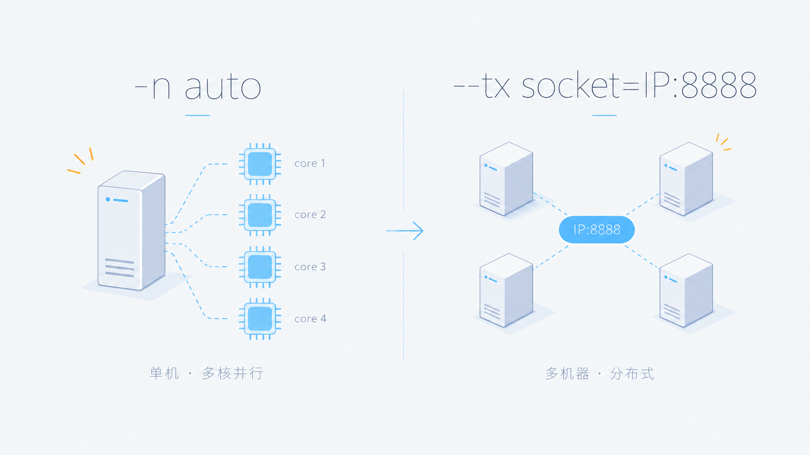

## 基本概念：用 `-n auto` 打底

在进入多机器之前，必须先搞懂单机并行——因为多机器只是在单机基础上**换了一条通信链路**而已。

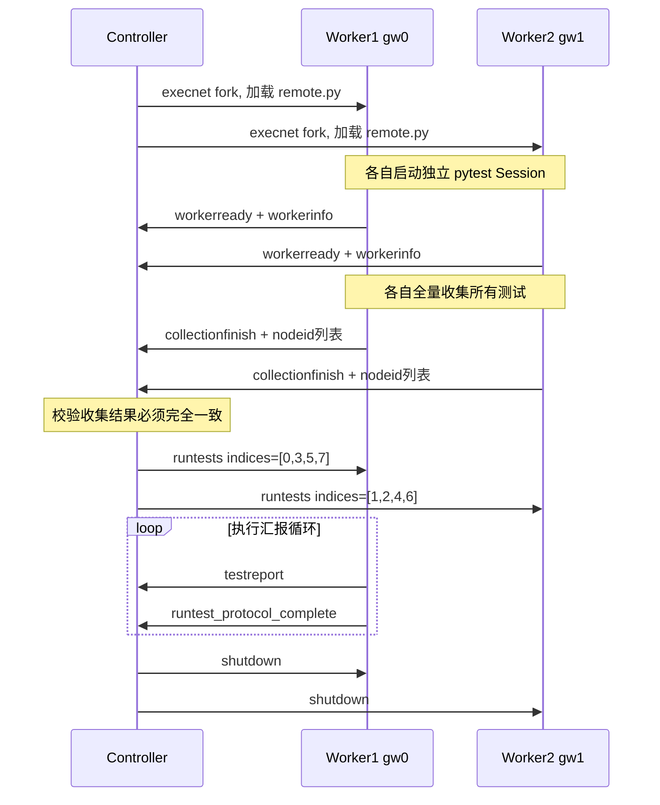

核心设计：Worker 先**全量收集**，Controller 再通过**整数索引**告诉它"跑哪几个"。Worker 之间不需要知道彼此的存在。

## 远程模式：当 Worker 不在本机时

### 通信层：execnet + socketserver

pytest-xdist 远程通信依赖 [execnet](https://codespeak.net/execnet)，专门为"跨进程执行 Python 代码"设计。它配合一个不到 133 行的 `socketserver.py` 实现远程 Worker 的启动。

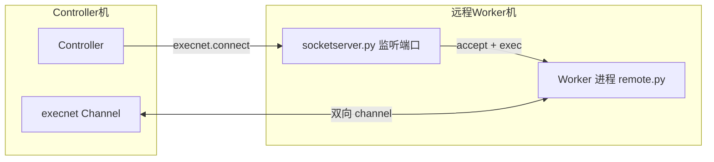

#### 启动步骤

**远端机器**（只需做一次）：

```bash
# 下载 socketserver.py 并启动
python socketserver.py
# 输出: Entering Accept loop (0.0.0.0:8888)
```

> `socketserver.py` 兼容 Windows/Linux/macOS。Windows 上 `fcntl` 不可用时会自动降级，功能不受影响。

**Controller 机器**：

```bash
pytest -d --tx socket=192.168.1.102:8888
```

#### 底层发生了什么

```python
# Controller 端 (workermanage.py)
spec = execnet.XSpec("socket=192.168.1.102:8888")
gateway = group.makegateway(spec)          # 建立 TCP 连接

# 把 xdist/remote.py 推送到远端执行
channel = gateway.remote_exec(remote_module)
# 远端进程 exec(remote.py)
# 进入 if __name__ == "__channelexec__": 分支

# 发送初始数据——只发配置，不发代码！
channel.send((workerinput, args, option_dict, change_sys_path))
```

**重要**：`remote_exec()` 只传了 `xdist/remote.py`（约 437 行的 runner 框架），你的测试代码**不会**通过 execnet 传输。测试代码必须已经存在于远程机器的文件系统上。

### 单通道 vs 双通道

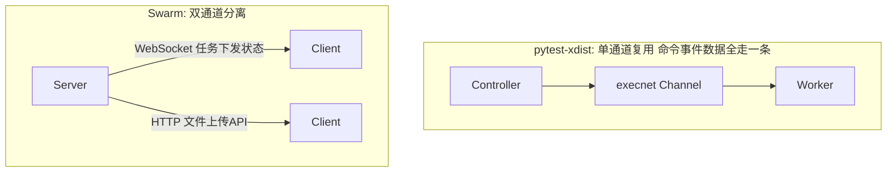

pytest-xdist 的 channel 是**双向的**：Controller 通过它发命令（`runtests`/`shutdown`/`steal`），Worker 通过它发事件（`testreport`/`collectionfinish`/`logstart`）。所有通信复用同一条 TCP 连接。

### Worker 的完整生命周期

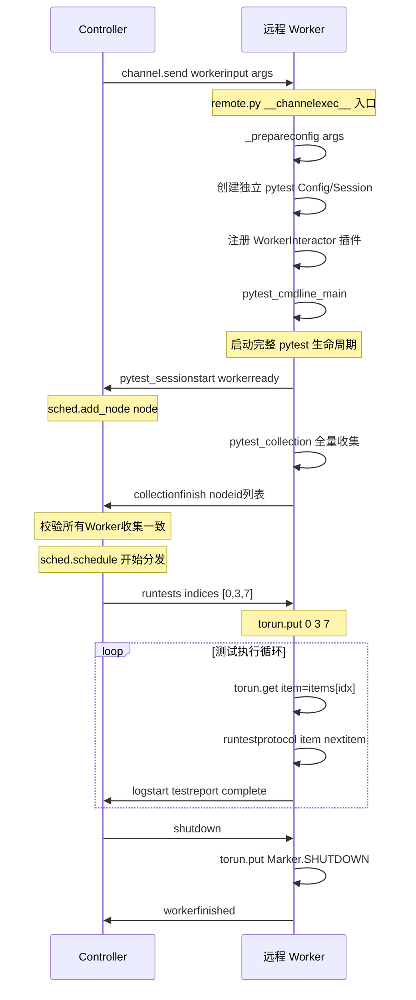

每个远程 Worker 内部跑的是一个**完整但被劫持了的 pytest Session**：

```python
# remote.py — Worker 进程入口
config = _prepareconfig(args, None)          # ① 构建独立 Config
setup_config(config, basetemp)               # ② 强制 dist=no
config.workerinput = workerinput             # ③ 注入 Worker 身份
config.workeroutput = {}                     # ④ workeroutput 通道
interactor = WorkerInteractor(config, channel) # ⑤ 注册劫持插件
config.hook.pytest_cmdline_main(config=config) # ⑥ 启动完整 pytest
```

> 一个 Worker 就是一个"被远程操控的 pytest"。它正常收集所有测试、正常创建 Session，只是 `runtestloop` 被 WorkerInteractor 劫持——不再自动遍历 `session.items`，而是从 Controller 的指令队列 `torun` 里取索引。

## 五大调度策略

pytest-xdist 提供了 **5 种调度器**，通过 `--dist` 参数选择：

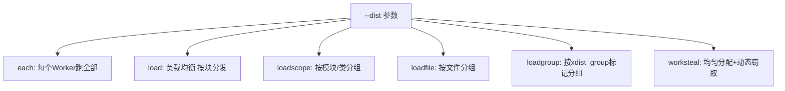

### LoadScheduling：朴素的负载均衡

```python
# load.py — 发测试的逻辑极其简单
def _send_tests(self, node, num):
    tests_per_node = self.pending[:num]    # 从全局池子切 num 块
    del self.pending[:num]                 # 从池子移除已分配
    self.node2pending[node].extend(tests_per_node)  # 记账
    node.send_runtest_some(tests_per_node)           # 发索引给Worker
```

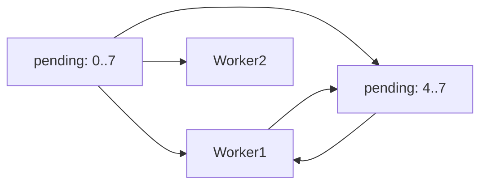

**low-watermark 机制**：Worker 待执行数低于阈值自动补充。如果单个测试慢（>0.1秒），减少补充量避免堆积：

```python
# load.py — 慢测试不急着塞
if duration >= 0.1 and len(node_pending) >= 2:
    return  # 等它跑完再给
```

### WorkStealingScheduling：快的别闲着

场景：Worker1 分到了很多慢测试，Worker2 全是快测试，Worker2 跑完在发呆。

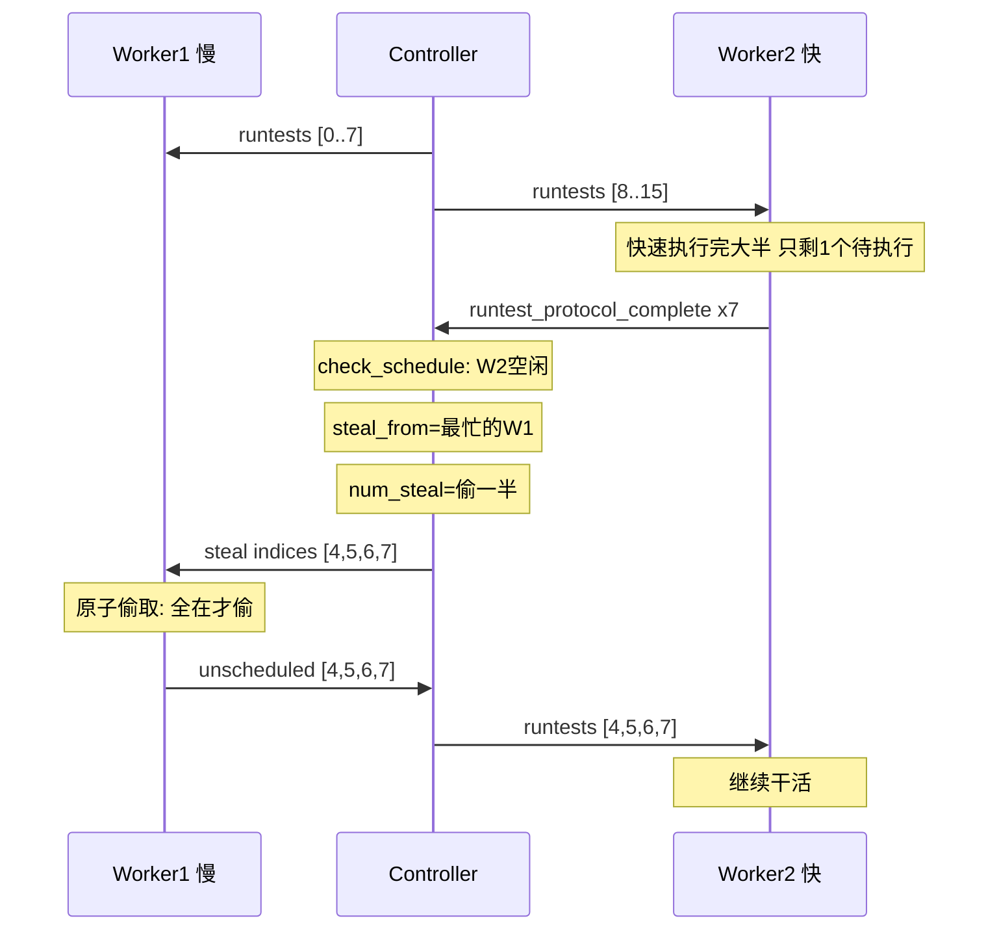

steal 的原子性保证：

```python
# worksteal.py — 要么全偷，要么一个不偷
with self.torun.lock() as locked_queue:
    stolen = list(i for i in locked_queue if i in requested_set)
    if len(stolen) == len(requested_set):
        # 所有请求的测试都还在队列 → 偷走
        self.torun.replace(
            i for i in locked_queue if i not in requested_set
        )
    else:
        stolen = []  # 有一个已经跑了 → 一个不偷
```

> "要么全偷，要么一个不偷"——工作窃取的艺术。

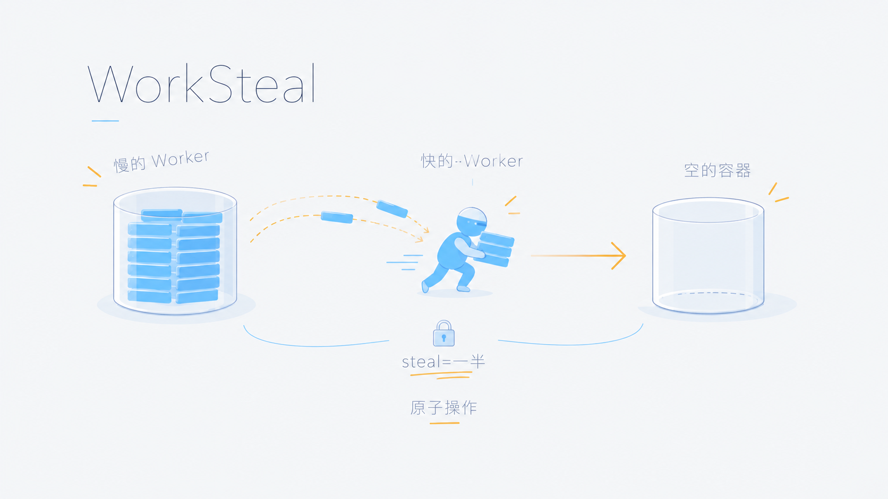

### LoadScopeScheduling：别反复创建 fixture

当你有 `session` 级别的 fixture（比如数据库连接），不同 Worker 反复创建/销毁非常浪费。`loadscope` 让共享 fixture 的测试尽可能留在同一个 Worker。

```python
# loadscope.py — scope 划分
def _split_scope(self, nodeid):
    return nodeid.rsplit("::", 1)[0]
# test_module.py::test_a          → test_module.py        模块级
# test_module.py::TestAPI::test_b  → test_module.py::TestAPI 类级
```

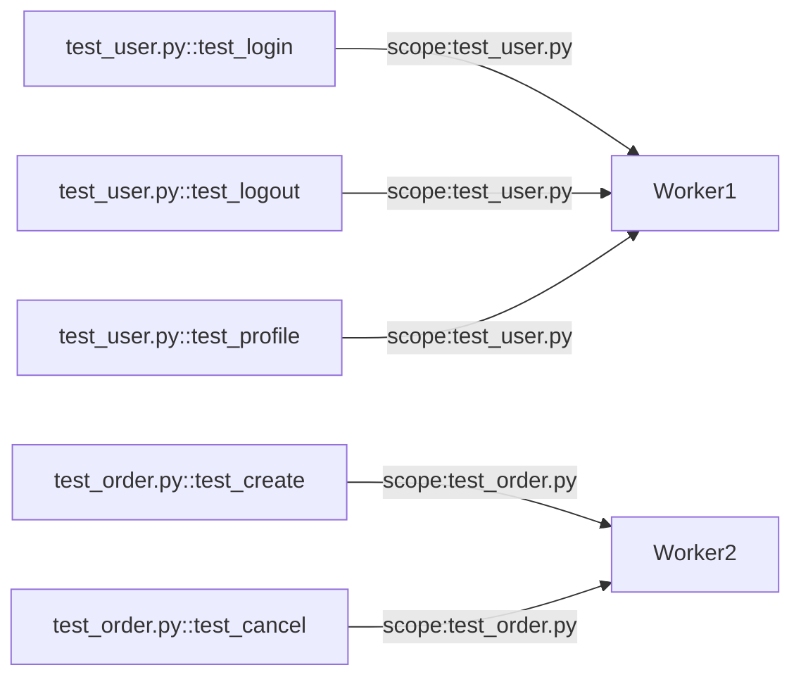

同一个 scope 下的所有测试绑定到同一个 Worker，Worker 的 Session 内 `module`/`class` scoped fixture 只创建一次。

## 崩溃恢复

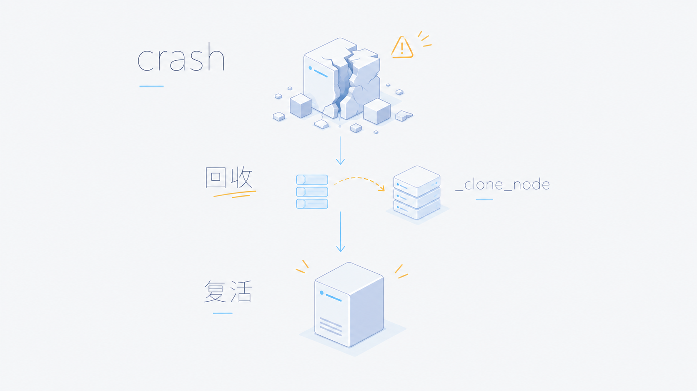

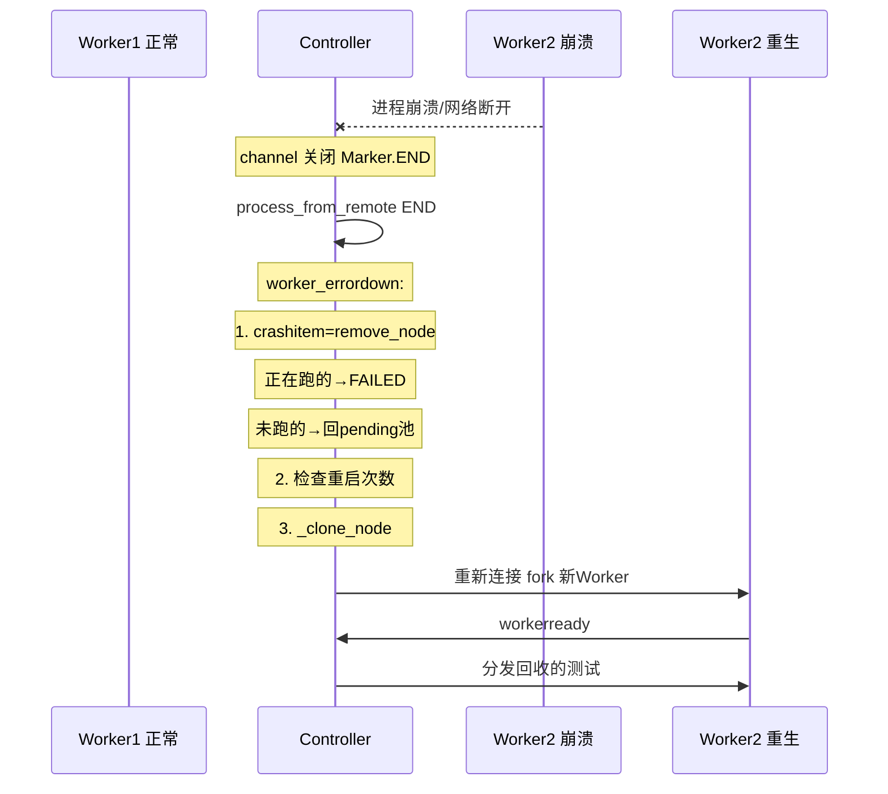

```python
# dsession.py — 崩溃恢复核心
def worker_errordown(self, node, error):
    crashitem = sched.remove_node(node)     # 回收未完成测试
    self._failed_nodes_count += 1
    maximum_reached = (
        self._max_worker_restart is not None
        and self._failed_nodes_count > self._max_worker_restart
    )
    if maximum_reached:
        self.triggershutdown()               # 超过次数上限，散会
    else:
        self._clone_node(node)               # 复活吧，Worker
```

默认最大重启次数 = `Worker数量 × 4`，可通过 `--max-worker-restart` 调整。

## 多机器实操步骤

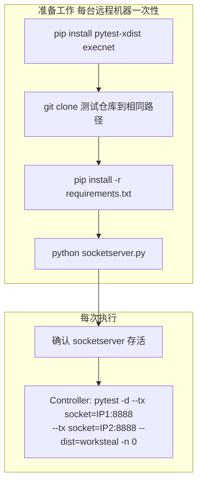

> `-n 0` 表示 Controller 本地不跑测试，全部发给远程 Worker。

## pytest-xdist vs Swarm

[Swarm](https://github.com/mikigo/swarm) 是另一个分布式测试框架，采用 Server-Client 架构。下面从**纯多机器远程测试**的角度做对比。

### 连接模型

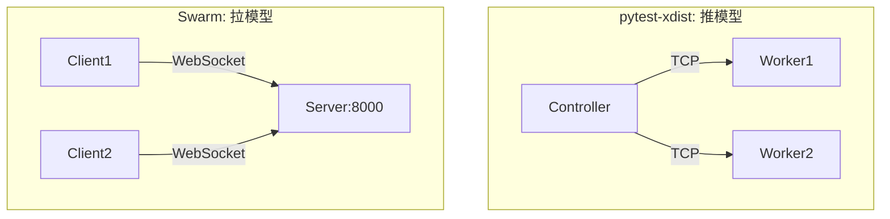

| | pytest-xdist | Swarm |
|---|---|---|
| 连接方向 | Controller → Worker | Client → Server |
| 网络要求 | Controller 必须直连每台 Worker | Worker 只需连 Server |
| 防火墙友好度 | 每台 Worker 要开端口 | 只开 Server 一个端口 |
| 动态加机器 | 改命令行加 `--tx`，重启 | 客户端随时连，热插拔 |

### 分发粒度——最根本的差异

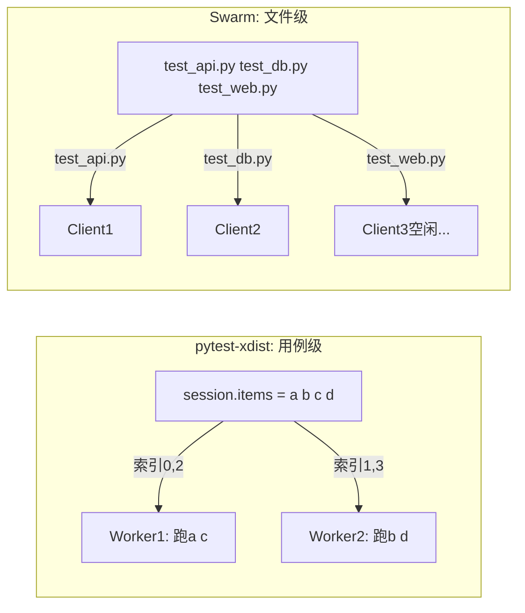

假设 3 台机器，3 个文件。`test_slow.py` 100 个慢用例（每用例 5s），另外两个文件各 100 个快用例：

| | pytest-xdist 用例级 | Swarm 文件级 |
|---|---|---|
| Worker1 耗时 | ~201s（慢用例被拆给 3 人） | 500s（独占整个慢文件） |
| Worker2 耗时 | ~201s | 100s → 空闲 400s |
| Worker3 耗时 | ~203s | 10s → 空闲 490s |
| **总耗时** | **~203s** | **500s** |

### 环境管理

```
pytest-xdist:
  每台 Worker:
    ① git clone 代码          ← 手动
    ② pip install 依赖         ← 手动
    ③ python socketserver.py   ← 手动
    ④ 每次执行: 直接跑         ← 零额外开销

Swarm:
  每台 Client:
    ① pip install swarm        ← 一次性
    ② swarm client start       ← 一次性
    ③ 每次任务: git clone → venv → pip install → 执行
    ④ 每次任务额外耗时 30-60s，但完全自动化
```

### 故障恢复

| 场景 | pytest-xdist | Swarm |
|---|---|---|
| Worker 断开检测 | channel 关闭即时触发 | 30s 心跳超时后检测 |
| 正在跑的测试 | 标记 FAILED + 自动重分配 | 无结果返回，状态不确定 |
| 未跑的测试 | 自动回 pending 池 | 无追溯机制 |
| Worker 替换 | `_clone_node()` 自动重建 | 重连即可，丢失上下文 |
| 需要人工介入 | 不需要 | **需要** |

### 报告与可观测性

| | pytest-xdist | Swarm |
|---|---|---|
| 实时输出 | `[gw0] PASSED test_xxx` | WebSocket 推送到 Server |
| 最终报告 | pytest 原生（JUnit XML 等） | 服务端汇总 Allure HTML |
| Worker 日志 | 不可见（execnet 限制） | 集中查看 |
| `-s` / `--capture=no` | ❌ 不支持 | ✅ |
| Web 面板 | ❌ 纯 CLI | ✅ HTTP API |

### 综合定位

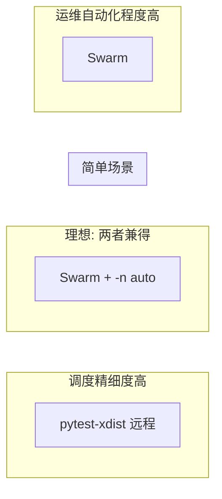

## 选型指南

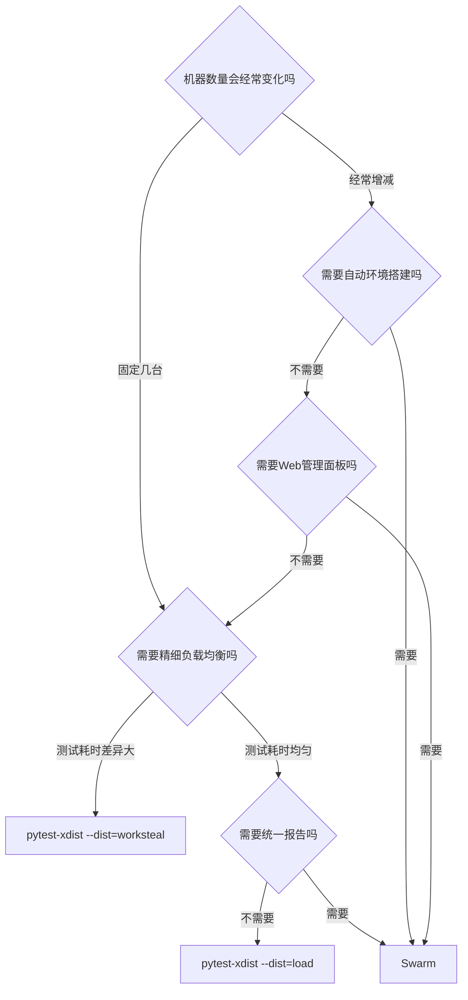

## 结语

pytest-xdist 的远程分布式模式本质上是一个**设计精巧的"远程遥控"系统**。它没有试图成为一个完整的测试平台，而是在 pytest 已有的生态里，用最小改动（一个 plugin、一个 remote 模块、一个 socket server）实现了多机器的协作。

它的核心哲学：**Worker 不需要知道全局，只需要知道自己的 `session.items` 列表和 Controller 让它跑的第几个。Controller 负责所有协调。**

Codebase 小（核心约 2200 行）、概念少（Controller + Worker + Channel）、和 pytest 生态零摩擦。代价是运维工作压在你身上——每台机器都要手动 clone、装依赖、起 socketserver。

Swarm 走了另一条路：用独立服务接管运维，但牺牲了调度精细度。没有谁绝对更好——**场景说了算**。

如果你想兼得两者优势：**Swarm 分发文件到客户端 + 客户端内部用 `pytest -n auto`**——这是目前最接近"理想"的方案。

---

*文中源码引用基于 pytest-xdist v3.8.0 和 Swarm v0.1.0。*