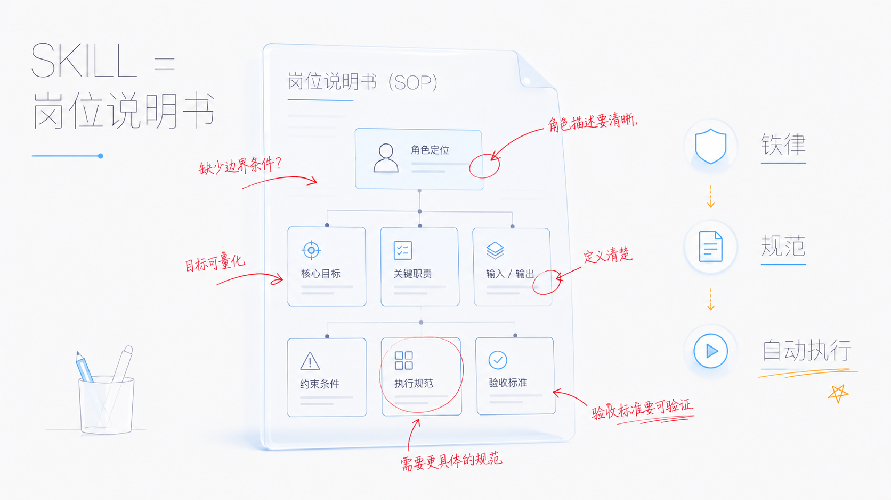
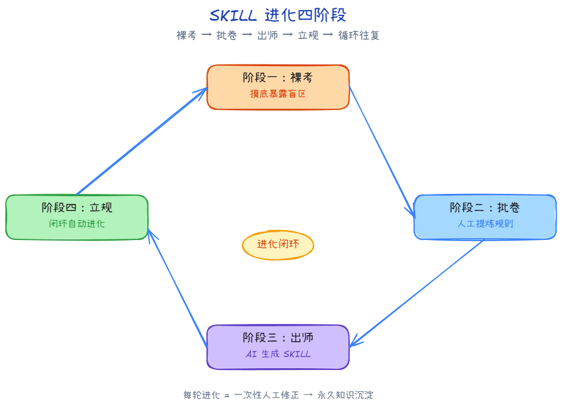
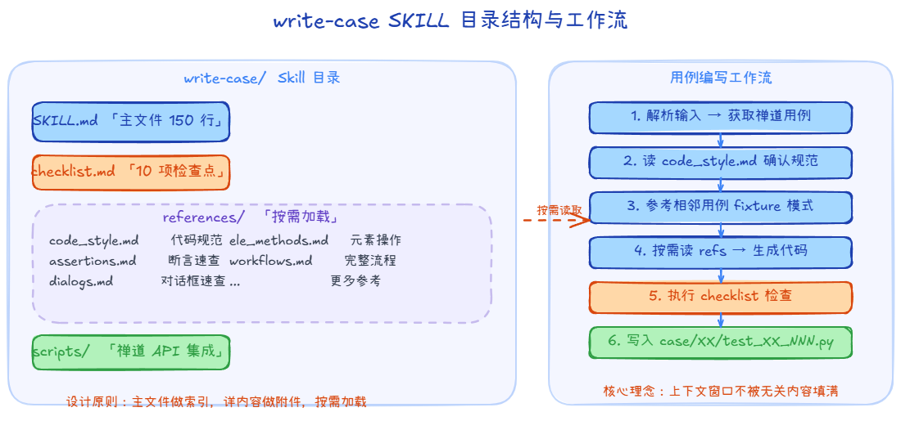
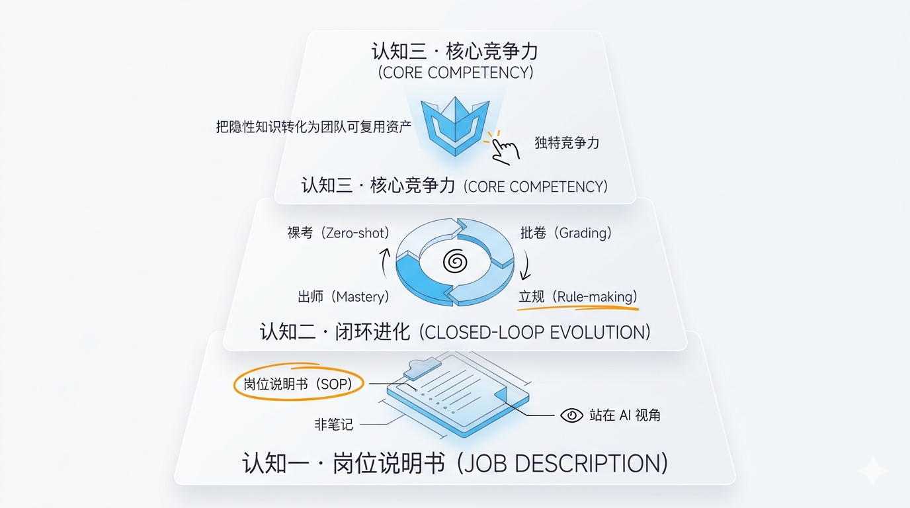

# SKILL进化论：测试工程师如何让AI越用越聪明

> "最好的工具不是让人不用干活，而是让人干更有价值的活。"

## 一个测试工程师的日常

早上 9 点，你打开电脑，禅道上又多了 300 条待自动化的用例。

300 条用例，意味着 300 种不同的业务场景。每条用例都涉及到相关业务逻辑的理解，用例步骤的拆分，方法调用，断言策略的设计，跑一遍修 Bug，提交代码。做完这些不算完，用例写完只是起点，持续的用例维护、框架升级适配、用例稳定性优化，才是真正的深水区。

### 问题的本质

自动化测试用例的编写，确实存在高度结构化的部分：

| 维度 | 特征 |
|------|------|
| 结构 | 固定模板（setup → steps → assert → teardown） |
| 规范 | 团队有明确的命名、调用、断言约定 |
| 变化 | 用例不同，但骨架一致 |

但结构一样不代表工作简单。

每条用例背后都需要：

| 维度 | 实际挑战 |
|------|---------|
| 业务理解 | 吃透需求，搞清楚"测什么、怎么测" |
| 编码能力 | 调试、封装、处理边界条件，不是填模板那么简单 |
| 创新力 | 新业务场景需要新的测试策略，没有现成范式可抄 |
| 工程维护 | 框架升级、依赖变更、用例稳定性优化——这些才是长期投入的大头 |

SKILL 要做的，不是"替代"这些智力活动，而是把已有的范式交给 AI，让测试工程师把精力放在真正需要人脑的地方。

于是就有了本文的核心命题：

> **如何让 AI 不仅"能写"，更要"会写"——而且越写越好？**

答案：**SKILL + 进化**。

:::info 本文定位
SKILL 是一种通用的扩展机制，可用于各种场景。但本文聚焦的是 **SailWind Layout PCB 布局设计软件的自动化 UI 测试**场景 —— 如何用 SKILL 让 AI 写出更规范的自动化测试用例。后文所有示例和方法论均基于 `write-case` 项目的实战经验。
:::

---

## 一、SKILL 快速入门



### 1.1 什么是 SKILL？

SKILL 是 AI Agent 的扩展机制。一句话解释：

:::tip 一句话理解 SKILL
SKILL = 写给 AI 看的**岗位说明书**（SOP）。AI 读了之后，就能按你的规范干活。
:::

创建一个 `SKILL.md` 文件，Claude 会把它加载到工具包里。当你的任务匹配 SKILL 的描述时，Claude 自动调用它——就像测试框架根据标签自动匹配用例一样。

### 1.2 什么时候该写 SKILL？

以下信号出现时，就应该考虑创建一个 SKILL：

| 信号 | 说明 |
|------|------|
| 反复粘贴同一段指令 | 在聊天框里贴了三次以上的操作步骤 |
| CLAUDE.md 变成操作手册 | 出现了大段"先做 A、再做 B"的程序性内容 |
| 团队总犯同样的错 | 新人或 AI 反复踩同一个规范坑 |
| 有一份没人翻的规范文档 | 文档很全，但没人记得看——把它变成 SKILL |

:::warning 注意
SKILL 的职责是**指导执行**，不是存档知识。如果只是想记录信息，用文档就够了；如果想让 AI 按信息行动，才需要 SKILL。
:::

### 1.3 SKILL 的存放策略

| 位置 | 路径 | 适用场景 |
|------|------|---------|
| 个人 | `~/.claude/skills/<name>/SKILL.md` | 通用方法论，跨项目复用 |
| 项目 | `.claude/skills/<name>/SKILL.md` | 项目特定规范，和代码一起版本管理 |
| 插件 | `<plugin>/skills/<name>/SKILL.md` | 团队级标准化 SKILL，统一分发 |

:::details 测试工程师的存放建议

- **个人级**：通用测试方法论——如"边界值分析"、"等价类划分"、"测试用例设计原则"
- **项目级**：当前项目的具体规范——如"write-case 的用例命名规则"、"LayoutExport 的断言调用方式"
- **插件级**：团队共享的标准化 SKILL，通过插件分发给所有成员，确保规范一致

:::

### 1.4 SKILL 的目录结构

以 write-case 技能为例，一个实战级的 SKILL 目录结构：

```bash
write-case/
├── SKILL.md                  # 主文件：工作流指引
├── checklist.md              # 写用例后执行检查清单
├── references/               # 按需加载的参考文档
│   ├── code_style.md         # 用例代码写法规范（模板、注释、fixture 等）
│   ├── assertions.md         # 断言方法速查
│   ├── dialogs.md            # 对话框速查表
│   ├── dialogs_patterns.md   # 对话框操作模式（桥接铜、跳线、筛选等）
│   ├── ele_methods.md        # Ele 对象方法、复选框、下拉框等元素操作
│   ├── keyboard_modeless.md  # 键盘操作、无模命令、放大视图
│   ├── right_click_menus.md  # 右键菜单速查表
│   └── workflows.md          # 完整操作流程（最佳实践）
└── scripts/                  # 可执行脚本
    └── fetch_zentao_case.py  # 从禅道 API 获取用例信息
```

核心文件只有 `SKILL.md`，其余文件按需引用、按需加载——主文件保持精简（约 150 行），AI 只在需要时才读取详细资料，上下文窗口不会被无关内容填满。

:::tip 与理想化的"模板目录"不同
很多教程建议你放 `templates/case_template.py` 和 `examples/good_case.py`。

实战经验是：**模板直接嵌入 references/code_style.md 里**，AI 按需读取更简洁；

**示例代码用现有用例工程 `case/XX/test_XX_NNN.py` 充当**，比单独维护示例文件更真实也更及时。
:::

### 1.5 一个最小 SKILL 示例

```yaml
---
name: write-case
description: 根据测试用例信息（禅道ID或手动提供），生成符合项目规范的 SailWind Layout 自动化测试用例代码。
metadata:
  version: 1.0
  author: mikigo
---

# Write Case

## 核心原则
1. 先看规范，再写代码
2. 调用封装方法（LayoutExport 门面类），不写底层操作
3. 断言资源统一管理（`res_assert_XX("NNN")`）

## ⚠️ 铁律（不可违反）
- **断言铁律**：中间步骤不加断言，最后一步必须有断言
- **注释铁律**：禅道步骤/预期原文一字不差保留为代码注释

## 写作流程
1. 解析输入（模块编号 / 禅道 CaseID / 手动提供步骤）
2. 从禅道 API 获取用例详细信息（如需要）
3. 读取 references/code_style.md 确认代码规范
4. 参考同模块相邻用例，复用 fixture 前置步骤模式
5. 按标准模板生成代码，同步 tag CSV，执行 checklist 检查
```

:::info 铁律的作用
这两条铁律不是"建议"，而是写进 SKILL 的**硬性约束**。AI 在生成代码时会自动遵守，而不是等到人工审查时才发现错误。这就是 SKILL 的力量——把经验变成约束，把约束变成自动化。
:::

---

## 二、SKILL 进化四阶段



SKILL 的核心价值不在于"写出来"，而在于"持续进化"。以下是一套经过实战验证的四阶段方法论，核心目标只有一个：

> **让 SKILL 自己卷自己，越用越聪明。**

:::tip 核心心法
把人工经验变成 AI 可以学习的规范，让每一轮"批卷"都成为 SKILL 进化的养分。
:::

---

### 阶段一：裸考 —— 给 AI 摸底

#### 什么叫"裸考"？

不给 Agent 任何额外提示，只给它两份材料：

1. **教材**：现有用例工程（`case/24/test_24_001.py`、`method/layout/` 方法库、断言资源 `case/24/assert_res/`）
2. **考题**：一条具体的禅道用例需求（如 CaseID 24759：修改管脚对特性中的线宽）

然后让它自己写，写完不要干预。

目的不是要一个能用的结果，而是看清它的"原始水平"。

#### 裸考暴露的典型问题

以下是 write-case 项目裸考阶段发现的真实问题：

| 问题类型 | 典型表现 | 根因 |
|---------|---------|------|
| 命名问题 | `test_route_width`、`TestLayout.testModifyWidth` | 不知道项目命名规范 `test_XX_NNN` |
| 调用问题 | 直接操作 `layout.dialog.xxx.click()`，不指定具体元素 | 不了解 `ok_btn` / `cancel_btn` 等元素命名规范 |
| 断言问题 | `assert True`、`assert layout.dialog.xxx.existed` | 不知道要用 `layout.asserts.assert_true()` / `layout.asserts.assert_image_exist()` |
| 资源路径 | `"./case_res/063.png"` 硬编码 | 不知道 `layout.res_assert_32("063")` 路径管理方式 |
| 注释问题 | 简化禅道步骤原文，或自己编步骤 | 不知道"注释铁律" |
| 断言位置 | 每一步后都加断言 | 不知道"断言铁律" |
| 导入问题 | `from method.layout.dialog import xxx` | 不知道只能导入 `pytest`, `BaseCase`, `LayoutExport` |
| Fixture | 缺少 `setup_teardown` fixture | 不了解项目模板结构 |

:::info 为什么这些问题反而是好事？
每一个问题都精准指出了 AI 需要被告知的规范点——**没有问题，你就不知道 SKILL 该写什么**。裸考的价值不在于产出可用的用例，而在于拿到一份"AI 知识盲区地图"。
:::

---

### 阶段二：人工批卷 —— Human-in-the-Loop

#### 批卷不是"改错"，是"提炼规则"

AI 写出来的代码，乍一看像那么回事，实际跑起来十有八九有问题。

人工介入需要做三件事：

```
1. 修 Bug    → 让脚本能跑起来（基本要求）
2. 改习惯    → 让代码符合团队规范（核心价值）
3. 做记录    → 把每次修改转化为可复用的知识（进化燃料）
```

#### 批卷记录模板

:::info "批卷记录 —— 用例：test_32_063"

| 问题 | 修改前 | 修改后 | 规范依据 |
|------|-------|--------|---------|
| 命名 | `test_route_push` | `test_32_063` | 用例命名：test_模块编号_序号 |
| 断言 | `assert True` | `layout.asserts.assert_image_exist(layout.res_assert_32("063"), color_bgr2gray=False)` | 使用统一断言方法库 + 模块资源路径 |
| 资源路径 | `"./res/063.png"` | `layout.res_assert_32("063")` | 通过 `res_assert_XX()` 管理断言资源路径 |
| 注释 | `# 步骤 1: 点击右键菜单`（简化了原文） | `# 步骤 1: 选择元器件J1的2号管脚右侧中间的导线段`（原文不动） | 注释铁律：禅道原文不得修改 |
| 断言位置 | 每一步都有 `layout.asserts.xxx()` | 仅最后一步有断言 | 断言铁律：中间步骤不断言 |
| 导入 | `from method.layout.dialog import pin_pair_properties` | 只保留 `from method.layout import LayoutExport` | 仅允许导入 pytest, BaseCase, LayoutExport |
| 打开文件 | `layout.open_layout()` | `layout.open_document_from_ftp(ftp_path="SailWind-AICases-Res/Layout/32/xxx.pcb")` | 统一用 `open_document_from_ftp` |

:::

:::warning 关键提醒

批卷记录**不是写给自己看的备忘录**，而是写给 AI 看的**错题本**。格式越规范，AI 学得越好。推荐使用表格——结构化数据比自然语言更容易被 AI 理解和泛化。

:::

### 阶段三：出师立规 —— 让 AI 生成 SKILL

#### 给 SKILL 一个清晰的定位

`write-case` 技能回答的核心问题：

> **"一个合格的 SailWind Layout 自动化测试用例长什么样？"**

#### 需要喂给 AI 的材料

```
1. 现有用例工程：case/24/, case/25/, case/32/ 等模块的用例代码
2. 方法库结构：method/layout/ 下的 LayoutExport 门面类及其对话框/方法模块
3. 历史批卷记录（第一轮、第二轮……）
4. 人工总结的经验教训：两条铁律、按需加载模式、禅道集成流程
```

然后让 AI 自己生成 SKILL——用 AI 写教 AI 的说明书。

#### SKILL 文档结构建议

:::details 展开查看 write-case 的实际 SKILL 结构

```markdown
# Write Case

## 定位
指导 Agent 编写符合项目规范的 SailWind Layout 自动化测试用例。

## 前置知识
- 参考用例工程路径：`case/XX/`（XX 为模块编号，如 `case/32/`）
- 代码写法规范：`references/code_style.md`
- 方法库结构：`method/layout/` → `LayoutExport` 门面类，聚合所有模块操作

## 输入解析
- 1~3 位数字 → 模块编号（批量模式，写下一条未自动化用例）
- 4 位及以上数字 → 禅道 CaseID（简写模式，自动识别模块）

## 核心铁律
- **断言铁律**：中间步骤不加断言，最后一步必须有断言
- **注释铁律**：禅道步骤/预期原文一字不差保留为代码注释

## 用例写作流程
1. 解析输入，从禅道 API 获取用例信息（调用 fetch_zentao_case.py）
2. 读取 references/code_style.md 确认代码模板
3. 查找同模块相邻用例作为参考（如写 test_25_019 优先参考 test_25_018）
4. 需要元素名时读 `*_ele.py`，需要流程时读 references/workflows.md
5. 按标准模板生成代码
6. 同步 tag/XX.csv
7. 执行 checklist.md 检查清单
8. 写入 case/XX/test_XX_NNN.py

## 常见错误及纠正

### 错误 1：直接操作底层元素，不调封装方法
- ❌ `layout.dialog.message_dialog.click()`
- ✅ `layout.dialog.message_dialog.ok_btn.click()`
- **依据**：所有 UI 操作通过 LayoutExport 门面类 + 对话框元素

### 错误 2：断言资源硬编码路径
- ❌ `layout.asserts.assert_image_exist("./case_res/063.png")`
- ✅ `layout.asserts.assert_image_exist(layout.res_assert_32("063"))`
- **依据**：资源路径通过 `res_assert_XX()` 按模块统一管理

### 错误 3：修改禅道注释原文
- ❌ `# 步骤 1: 点击右键菜单`（简化了原文）
- ✅ `# 步骤 1: 选择元器件J1的2号管脚右侧中间的导线段`（原文不动）
- **依据**：注释铁律 —— 禅道原文一字不差保留

### 错误 4：中间步骤添加断言
- ❌ 每个步骤后都有 `layout.asserts.assert_xxx()`
- ✅ 仅最后一步添加断言
- **依据**：断言铁律 —— 中间步骤不断言，最后一步必断言

### 错误 5：多余导入
- ❌ `from method.layout.dialog import pin_pair_properties`
- ✅ 只导入 `pytest`, `BaseCase`, `LayoutExport`
- **依据**：所有操作通过 LayoutExport 门面类访问
```

:::

---

### 阶段四：写入规则 —— 让闭环转起来

#### 配套的维护机制

SKILL 写好之后，如果没有配套的更新机制，不出三个月就会和实际脱节。

在项目 `CLAUDE.md` 中加入以下维护规则（write-case 项目实际采用的规则）：

```markdown
## 写用例后必做检查

每次使用 /write-case 技能编写完测试用例后，必须检查并更新 SKILL 文档：

1. 读取 .claude/skills/write-case/SKILL.md
2. 检查本次写用例过程中是否使用了 SKILL 中未记录的新模式：
   - 新的对话框操作路径
   - 新的元素交互方式
   - 新的断言方法
   - 新的键盘/鼠标操作
   - 新的 fixture 前置步骤模式
3. 如有发现，将新模式补充到 SKILL references 对应文档中

## 用户手动修改用例后同步 SKILL

当用户手动修改了用例文件后：

1. 对比用户修改内容与 SKILL 中的已有模式
2. 用户是否将某种操作写法改成了更优方式？（如 `mousekey.downs` → `cell_select_item`）
3. 用户是否引入了 SKILL 中未记录的新元素或方法？
4. 用用户的改法更新 SKILL references，保持文档与实际代码同步
```

:::tip write-case 项目的实际同步触发点
write-case SKILL 的 `checklist.md` 第 7 步明确要求："如发现新发现的模式（如用户手动修改引入了新写法），同步更新 `references/code_style.md`"。**这条规则将批卷 → 立规变成了自动流程**，而不是依赖人工记忆。
:::

#### 进化闭环

整个进化闭环可以描述为：

**第一步**，Agent 基于当前 SKILL 规范编写用例。例如调用 `写用例 32 24800`，Agent 加载 write-case SKILL，从禅道获取用例信息，参考 `case/32/test_32_066.py` 的写法，生成 `test_32_067.py`。

**第二步**，人工审查并批改。发现 Agent 在某个对话框操作上用了次优写法，手动改为 `cell_select_item("CAM.Solder mask.Adjust")`。

**第三步**，将这次修改模式提炼为规范，更新到 `references/ele_methods.md` 中：`layout.dialog.object_attributes.cell_select_item("属性名").click()`。

**第四步**，Agent 在下一次写用例时，自动加载更新后的 SKILL，在相同场景下直接使用 `cell_select_item`，不再犯同样的错误。

四步走完一轮，回到第一步——循环往复。每完成一轮，SKILL 就比上一轮更完善，Agent 写的用例就比上一轮更规范。

:::tip 闭环的核心价值
它把一次性的人工修正变成了永久的知识沉淀。你今天改了一个错误并写进了 SKILL，AI 明天就不会再犯——而不是你明天还要再改一遍。
:::

---

## 三、SKILL 进阶技巧



当 SKILL 经过几轮进化趋于稳定后，可以进一步利用以下特性提升效果。

### 3.1 Frontmatter 配置

合理的 Frontmatter 配置能让 SKILL 在正确的时机被正确的方式调用。

write-case 实际使用的配置：

```yaml title="SKILL.md"
---
name: write-case
description: 根据测试用例信息（禅道ID或手动提供），生成符合项目规范的 SailWind Layout 自动化测试用例代码。
---
```

:::details Frontmatter 关键字段速查

| 字段                       | 必需 | 描述                                                         |
| :------------------------- | :--- | :----------------------------------------------------------- |
| `name`                     | 否   | Skill 列表中显示的显示名称。默认为目录名称。在 `/` 后的调用方式有何不同。 |
| `description`              | 推荐 | Skill 的功能以及何时使用它。Claude 使用它来决定何时应用该 skill。如果省略，使用 markdown 内容的第一段。将关键用例放在前面：组合的 `description` 和 `when_to_use` 文本在 skill 列表中被截断为 1,536 个字符以减少上下文使用。 |
| `when_to_use`              | 否   | 关于 Claude 何时应该调用该 skill 的额外上下文，例如触发短语或示例请求。附加到 skill 列表中的 `description`，并计入 1,536 个字符的上限。 |
| `argument-hint`            | 否   | 自动完成期间显示的提示，指示预期的参数。示例：`[issue-number]` 或 `[filename] [format]`。 |
| `arguments`                | 否   | 用于 skill 内容中`$name` 替换的命名位置参数。接受空格分隔的字符串或 YAML 列表。名称按顺序映射到参数位置。 |
| `disable-model-invocation` | 否   | 设置为 `true` 以防止 Claude 自动加载此 skill。用于你想使用 `/name` 手动触发的工作流。也防止该 skill 被预加载到 subagents中。默认值：`false`。 |
| `user-invocable`           | 否   | 设置为 `false` 以从 `/` 菜单中隐藏。用于用户不应直接调用的背景知识。默认值：`true`。 |
| `allowed-tools`            | 否   | 当此 skill 处于活动状态时，Claude 可以使用而无需请求权限的工具。接受空格分隔的字符串或 YAML 列表。 |
| `model`                    | 否   | 当此 skill 处于活动状态时要使用的模型。覆盖适用于当前轮的其余部分，不保存到设置；会话模型在你的下一个提示时恢复。接受与 `/model`相同的值，或 `inherit` 以保持活动模型。 |
| `effort`                   | 否   | 当此 skill 处于活动状态时的工作量级别。覆盖会话工作量级别。默认值：继承自会话。选项：`low`、`medium`、`high`、`xhigh`、`max`；可用级别取决于模型。 |
| `context`                  | 否   | 设置为 `fork` 以在分叉的 subagent 上下文中运行。             |
| `agent`                    | 否   | 当设置 `context: fork` 时要使用的 subagent 类型。            |
| `hooks`                    | 否   | 限定于此 skill 生命周期的 hooks。有关配置格式，请参阅 Skills 和代理中的 Hooks。 |
| `paths`                    | 否   | Glob 模式，限制何时激活此 skill。接受逗号分隔的字符串或 YAML 列表。设置后，Claude 仅在处理与模式匹配的文件时自动加载该 skill。使用与路径特定规则相同的格式。 |
| `shell`                    | 否   | 用于此 skill 中 `` !`command` `` 和 ` ```! ` 块的 shell。接受 `bash`（默认）或 `powershell`。设置 `powershell` 在 Windows 上通过 PowerShell 运行内联 shell 命令。需要 `CLAUDE_CODE_USE_POWERSHELL_TOOL=1`。 |

:::

### 3.2 禅道 API 集成

write-case SKILL 的一个核心能力：与禅道项目管理系统对接，自动获取用例信息。

```bash
# 自动识别模块编号，获取禅道 CaseID 24759 的用例信息
python scripts/fetch_zentao_case.py 24759

# 批量获取模块 29 下所有未自动化的用例列表
python scripts/fetch_zentao_case.py --module 29 <项目根目录>
```

**智能输入解析**：
- `写用例 29`（1~3 位）→ 批量模式，自动取模块 29 下一条未自动化用例
- `写用例 24759`（4 位+）→ 简写模式，通过 `modulePairs` 映射表自动反推模块编号
- `写用例 27 24759` → 指定模块 27，写 CaseID 24759

**自动排除已自动化用例**：脚本自动读取 `tag/29.csv` 和 `case/29/test_29_*.py` 文件头部注释，将已自动化的 CaseID 剔除。

:::tip 实际效果
测试工程师只需要说"写用例 29"，AI 就知道要去写模块 29 的哪一条用例。不需要手动查禅道、手动找编号、手动复制步骤。这个流程减少了 5 步人工操作。
:::

### 3.3 模块编号系统与 tag CSV 同步

write-case 项目中的用例按模块编号组织：

```bash
case/
├── 24/
│   ├── test_24_001.py
│   ├── test_24_002.py
│   └── assert_res/
├── 32/
│   ├── test_32_063.py
│   ├── test_32_064.py
│   └── assert_res/
...
```

每个模块对应一个 `tag/XX.csv` 文件，记录 ScriptID → 禅道 CaseID 的映射，实现双向追踪：

```bash title="tag/32.csv"
063,24800
064,24801
065,24802
```

写用例完成后，SKILL 流程自动执行 tag CSV 同步：从文件名提取 ScriptID（`test_32_067.py` → `067`），从文件头注释提取禅道 ID，追加到 CSV。

### 3.4 按需加载参考文档

write-case 的 `references/` 目录有 8 个文档，SKILL 主文件控制在 150 行以内。指令明确告诉 AI 何时读取哪个文件：

```markdown
## 按需加载参考文档

- **必读**：references/code_style.md（代码模板和注释规范）
- **需要具体元素名时**：直接读 method/layout/dialog/ 下的 *_ele.py，比 references 更准确
- **需要断言方法**：references/assertions.md
- **需要对话框操作**：references/dialogs.md 或 dialogs_patterns.md
- **需要键盘/无模命令**：references/keyboard_modeless.md
- **需要右键菜单**：references/right_click_menus.md
- **需要完整流程**：references/workflows.md
```

:::tip 与"把所有规范塞进一个文件"的对比
把所有内容塞进 SKILL.md，看似方便，实际上上下文窗口很快被占满，AI 反而找不到重点。**主文件做索引，详内容做附件**——既保持精简，又保证信息完整。
:::

### 3.5 Checklist 机制

write-case 使用独立的 `checklist.md` 文件，包含 10 项检查点。写用例完成后逐项打勾：

```markdown
- [ ] 用例文件头：三行注释完整（文件名、禅道ID、用例标题）
- [ ] 导入：只导入 pytest, BaseCase, LayoutExport
- [ ] Fixture：setup_teardown 存在，前置步骤注释保留原文
- [ ] 注释风格：步骤/预期严格交替，禅道原文不修改不简化
- [ ] 断言：用例最后一步骤之后必须有断言
- [ ] 断言写法：状态栏/图像比对写法正确
- [ ] tag CSV：已同步追加 ScriptID,CaseID
- [ ] 编号顺序：同模块下一个可用编号
- [ ] 前置步骤复用：优先参考相邻用例的实际坐标和写法
- [ ] 未定义方法/元素：遇到需要添加的，不停留，直接推断写法
```

### 3.6 相邻用例参考策略

write-case SKILL 的一个关键设计：写用例时**优先参考相邻编号的用例**。

> 如写 `test_25_019`，优先参考 `test_25_018`，再往前参考 `test_25_017`。

为什么？因为相邻用例通常：
- 操作同一个模块的相近功能，共享相似的 fixture 前置步骤
- 使用相同的文档资源（`open_document_from_ftp` 路径相似）
- 使用相同的对话框和元素，坐标和参数可以直接复用

这条策略大幅提升了 AI 写用例的首次通过率。

### 3.7 动态上下文注入

SKILL 支持在加载时运行 shell 命令，将实时数据注入提示词：

```markdown
## 当前项目状态
- 最近修改的用例：!`git diff --name-only HEAD~1 | grep test_`
- 当前分支：!`git branch --show-current`
- 模块 32 用例总数：!`ls case/32/test_32_*.py | wc -l`
```

:::tip 实际效果
AI 写用例时能感知项目实时状态——知道当前在哪个分支、最近改了什么文件。不再是对着空气写代码，而是带着上下文写。
:::

---

## 四、总结



### 三个关键认知

:::tip 认知一：SKILL 是岗位说明书，不是笔记
写好 SKILL 的关键是站在 AI 的角度思考——它缺什么信息、会犯什么错误、需要什么约束才能按你的规范执行？write-case 的两条铁律（断言 + 注释）就是最佳范例：把最容易犯的错变成不可违反的规则。
:::

:::tip 认知二：进化靠闭环，不靠一次性投入
裸考 → 批卷 → 出师 → 立规，四个阶段循环往复，SKILL 才会越来越强。SKILL 不是写完就完了的东西，它是活的。write-case 项目通过 checklist.md 的最后一项"发现新模式 → 同步更新 references"，将这个闭环自动化了。
:::

:::tip 认知三：这是测试工程师的独特竞争力
谁最懂测试规范？谁最清楚什么是对的、什么是错的用例？答案就是你。把这份隐性知识转化为 SKILL，你的经验就不再只属于你一个人——它变成了团队可复用的资产，也成了你自己的效能杠杆。
:::

### 最后的话

> 最好的工具不是让人不用干活，而是让人干更有价值的活。

当 AI 帮你搞定了用例编写这类重复劳动之后，你的时间就可以花在真正需要测试智慧的事情上——设计更巧妙的测试策略、挖掘更深层次的缺陷、优化整个质量保障流程。

**这才是测试工程师的升级之路。SKILL 进化，共勉。**
