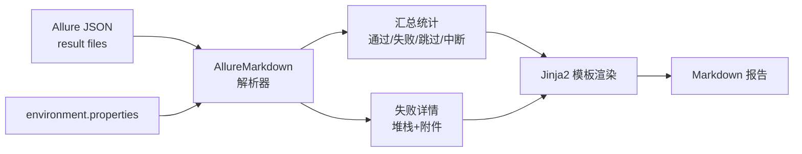

# 📋 allure-markdown — Allure 转 Markdown 报告工具

> "零依赖，一行命令将 Allure 测试结果转为 Markdown 报告。"

## 概述

`allure-markdown` 是一个 Python 工具，能将 Allure 测试结果（JSON 元数据）直接转换为 Markdown 格式的测试报告。无需安装 Allure CLI 工具，无需 Java 环境，一条命令即可生成可读的 Markdown 报告。同时支持 CLI 命令、Python API 和 pytest 插件三种使用方式。

**GitHub**: [https://github.com/mikigo/allure-markdown](https://github.com/mikigo/allure-markdown)

**PyPI**: [https://pypi.org/project/allure-markdown/](https://pypi.org/project/allure-markdown/)

**许可证**: Apache 2.0

## 解决的痛点

- 生成 Allure 报告需要安装 Allure CLI + Java 环境，依赖重
- CI/CD 流水线中安装 Java/Allure 耗时且不稳定
- 需要可嵌入到 Git 仓库、PR 评论等场景的纯文本报告
- Allure HTML 报告不便于在纯文本环境（CLI、邮件、Markdown 文档）中查看

## 核心特性

### 零依赖

不依赖 Allure 生成工具、Java 环境或任何第三方库，纯 Python 标准库实现。

### 三种使用方式

| 方式 | 适用场景 |
|------|---------|
| **CLI 命令行** | 一键转换，适合脚本和 CI/CD |
| **Python API** | 程序化调用，适合嵌入自定义流程 |
| **pytest 插件** | 测试结束后自动生成，零配置 |

### CLI 命令

```bash
allure-markdown [OPTIONS]
```

| 参数 | 简写 | 说明 | 默认值 |
|------|------|------|--------|
| `--results-dir` | `-r` | Allure 结果目录 | `allure-results` |
| `--output` | `-o` | 输出 Markdown 文件 | `allure_markdown_report.md` |
| `--title` | `-t` | 报告标题 | `Allure Markdown Report` |
| `--description` | `-d` | 报告描述 | - |
| `--custom-content` | `-c` | 自定义内容 | - |
| `--verbose` | `-v` | 详细输出 | `False` |

### Python API

```python
from allure_markdown import AllureMarkdown

converter = AllureMarkdown(
    results_dir="allure-results",
    output="report.md",
    title="Test Report",
    description="Generated from Allure results"
)
converter.gen()
```

### Pytest 插件

```bash
# 基本使用
pytest --alluredir=allure-results --allure-markdown-generate

# 自定义配置
pytest --alluredir=my-results \
       --allure-markdown-generate \
       --allure-markdown-title="My Test Report" \
       --allure-markdown-output="test_report.md"
```

| 插件参数 | 说明 | 默认值 |
|---------|------|--------|
| `--allure-markdown-generate` | 生成 Markdown 报告 | `False` |
| `--allure-markdown-title` | 报告标题 | `Allure Markdown Report` |
| `--allure-markdown-description` | 报告描述 | - |
| `--allure-markdown-output` | 输出文件路径 | `allure_markdown_report.md` |
| `--allure-markdown-custom-content` | 自定义内容 | - |

### 报告内容结构

生成的 Markdown 报告包含：

| 章节 | 说明 |
|------|------|
| **Title** | 报告标题，支持自定义 |
| **Description** | 报告描述，支持自定义 |
| **Environment** | 环境信息，从 `environment.properties` 读取 |
| **Summary** | 测试汇总统计（通过 / 失败 / 跳过 / 中断） |
| **Fail Details** | 失败测试的详细信息、错误堆栈和附件 |

### 附件支持

自动处理 Allure 测试结果中的附件：文本内容内嵌展示，图片以 Markdown 图片语法嵌入，视频以链接引用。

### 环境信息配置

在 Allure 结果目录创建 `environment.properties`：

```properties
Browser=Chrome
Browser.Version=120.0
OS=Windows 11
Python=3.11.0
```

## 技术栈

| 组件 | 技术 |
|------|------|
| 语言 | Python 3.x |
| 构建系统 | Hatchling |
| 模板引擎 | Jinja2 |
| CLI 框架 | argparse（标准库） |
| 核心依赖 | 无（纯标准库 + 可选 Jinja2） |
| 测试 | pytest |

## 项目结构

```
allure-markdown/
├── allure_markdown/              # 主包
│   ├── __init__.py               # 公开 API：AllureMarkdown 类
│   ├── __version__.py            # 版本号
│   ├── cli.py                    # CLI 入口（argparse + 参数解析）
│   ├── main.py                   # 核心转换逻辑（~11KB）
│   │   ├── AllureMarkdown 类      # 解析 JSON → 统计 → 渲染模板
│   │   └── 附件处理（文本/图片/视频）
│   ├── config.py                 # 默认配置常量
│   ├── pytest_plugin.py          # pytest 钩子（会话结束自动生成）
│   └── templates/                # Jinja2 报告模板
├── tests/                        # 测试用例
├── metadata/                     # 测试用 Allure 元数据
├── pyproject.toml                # 项目元数据 + 构建配置
├── pytest.ini                    # pytest 配置
├── run.py                        # 快速启动脚本
└── debug.py                      # 调试入口
```

## 架构设计



## 使用方式

### 安装

```bash
pip install allure-markdown
```

### CLI 使用

```bash
# 默认配置
allure-markdown

# 指定目录和输出
allure-markdown -r allure-results -o my_report.md

# 自定义标题和描述
allure-markdown -t "My Test Report" -d "Custom description"

# 详细输出模式
allure-markdown -v
```

### Pytest 集成

```bash
pytest --alluredir=allure-results --allure-markdown-generate
```

### Python API

```python
from allure_markdown import AllureMarkdown

AllureMarkdown(
    results_dir="allure-results",
    output="report.md",
    title="Test Report",
    description="Generated from Allure results"
).gen()
```

## 许可证

Apache 2.0
