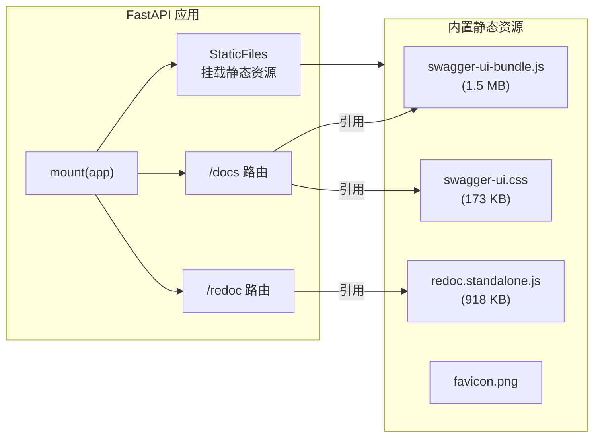

# 📚 fastapi-self-hosting-docs — FastAPI 自托管文档

> "文档在自己手里，不依赖外网。"

## 概述

`fastapi-self-hosting-docs` 是一个轻量级 Python 包，将 Swagger UI 和 ReDoc 的静态资源（JS、CSS、favicon）直接打包进应用内，从本地提供文档服务，彻底摆脱对 CDN 的依赖。

FastAPI 默认的 `/docs` 和 `/redoc` 页面需要从外部 CDN 加载 Swagger UI 和 ReDoc 资源。在内网环境、离线部署或网络受限场景下，这些页面可能加载失败或无法访问。这个包一行代码解决这个问题。

**GitHub**: [https://github.com/mikigo/fastapi-self-hosting-docs](https://github.com/mikigo/fastapi-self-hosting-docs)

**PyPI**: [https://pypi.org/project/fastapi-self-hosting-docs/](https://pypi.org/project/fastapi-self-hosting-docs/)

## 解决的痛点

- 内网部署 FastAPI 应用，`/docs` 页面白屏或加载失败
- 离线环境无法访问 CDN，Swagger UI / ReDoc 不可用
- 每次访问文档都要加载外部 JS，访问速度慢
- 对外部 CDN 服务有隐性依赖，存在可用性风险

## 核心特性

| 特性 | 说明 |
|------|------|
| 自托管文档 | Swagger UI 和 ReDoc 资源从本地提供，不依赖外网 |
| Swagger UI | 在 `/docs` 提供交互式 API 文档 |
| ReDoc | 在 `/redoc` 提供替代风格的 API 文档 |
| 自定义 favicon | 内置自定义图标，适用于 Swagger UI 和 ReDoc |
| 零配置集成 | 替换 FastAPI 默认文档只需一行 `mount(app)` |
| 轻量无侵入 | 仅依赖 `fastapi`，不引入额外运行时依赖 |

## 快速开始

### 安装

```bash
pip install fastapi-self-hosting-docs
```

### 基本用法

```python
import uvicorn
from fastapi import FastAPI
import fastapi_self_hosting_docs

# 禁用 FastAPI 默认文档路由
app = FastAPI(docs_url=None, redoc_url=None)

# 挂载自托管文档
fastapi_self_hosting_docs.mount(app)

uvicorn.run(app)
```

启动后访问：
- `http://localhost:8000/docs` — Swagger UI 文档（资源本地加载）
- `http://localhost:8000/redoc` — ReDoc 文档（资源本地加载）

### 自定义 favicon

```python
fastapi_self_hosting_docs.mount(
    app,
    favicon_url="https://example.com/my-icon.png"
)
```

## 工作原理



### `mount()` 函数做的事

1. **校验** — 检查 `app.docs_url` 和 `app.redoc_url` 均为 `None`，防止路由冲突
2. **挂载静态目录** — 将内置的 JS/CSS/favicon 通过 `StaticFiles` 暴露到 HTTP
3. **注册 `/docs`** — 调用 `get_swagger_ui_html()`，JS/CSS URL 指向本地地址
4. **注册 `/redoc`** — 调用 `get_redoc_html()`，JS URL 指向本地地址
5. **注册 OAuth2 回调** — Swagger UI OAuth2 流程所需的重定向端点
6. **设置 favicon** — 默认使用内置图标，支持自定义 URL

## 项目结构

```
fastapi-self-hosting-docs/
├── fastapi_self_hosting_docs/
│   ├── __init__.py                              # 核心逻辑（~56 行，mount 函数）
│   ├── __version__.py                           # 版本号
│   └── fastapi-self-hosting-docs-static/        # 内置静态资源
│       ├── swagger-ui-bundle.js                 # Swagger UI JS（自托管副本）
│       ├── swagger-ui.css                       # Swagger UI 样式表
│       ├── redoc.standalone.js                  # ReDoc JS（自托管副本）
│       └── favicon.png                          # 自定义 favicon
├── test/
│   └── test_1.py                                # 冒烟测试
├── img/
│   ├── docs.png                                 # Swagger UI 截图
│   └── redoc.png                                # ReDoc 截图
├── pyproject.toml                               # 项目配置（hatchling 构建）
├── requirements.txt                             # 依赖（fastapi）
├── publish.bat                                  # PyPI 发布脚本
├── LICENSE                                      # Apache 2.0
└── README.md                                    # 中英文双语文档
```

## 技术栈

| 类别 | 技术 |
|------|------|
| Web 框架 | FastAPI |
| 静态文件 | Starlette StaticFiles |
| 构建系统 | hatchling |
| Python 版本 | >= 3.6 |
| 许可证 | Apache 2.0 |

## 开发状态

版本：`0.8.0`

首个版本 `0.5.0` 发布于 2026-02-26，当前为稳定迭代版本，核心功能已完成。

## License

Apache 2.0
