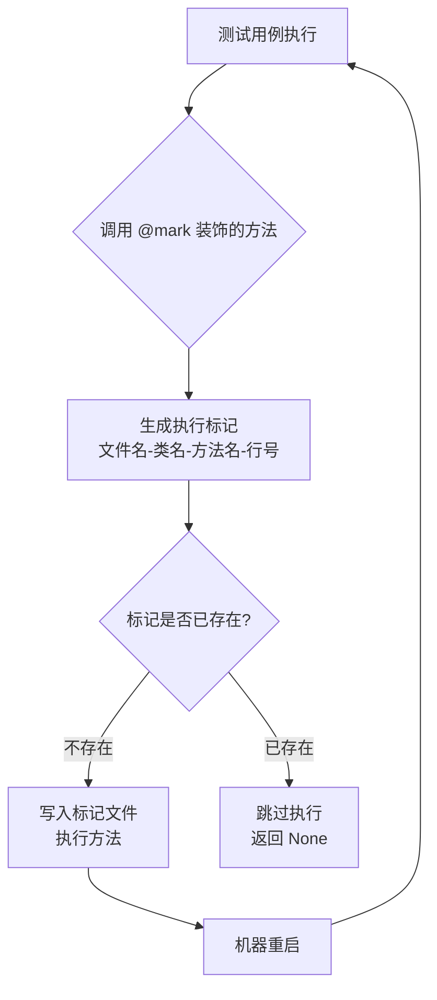

# 🔄 letmego（任我行）— 测试用例断电续跑方案

> "机器重启了，测试也能从中断处接着跑。"

## 概述

`letmego`（任我行）是一个控制 Python 函数执行的方案，核心功能是实现**测试用例的断电续跑**。当自动化测试遇到不得不中断的场景（如机器重启）时，重启后能自动跳过已执行过的步骤，从断点处继续执行。

**GitHub**: [https://github.com/linuxdeepin/letmego](https://github.com/linuxdeepin/letmego)

**文档站**: [https://linuxdeepin.github.io/letmego](https://linuxdeepin.github.io/letmego)

**PyPI**: [https://pypi.org/project/letmego/](https://pypi.org/project/letmego/)

**版本**: 2023.10.16

## 解决的痛点

- 自动化测试包含重启步骤，机器重启后测试进程丢失，无法继续
- 重启后需要手动判断哪些步骤已执行，重新编排测试流程
- 系统升级、内核更新等必须重启的场景下，自动化测试中断不可恢复
- 需要一套轻量级的执行状态追踪机制，不依赖外部数据库

## 核心设计



每条执行标记格式：

```
<用例文件>-<用例类>-<用例方法>-<页面类>-<页面方法>-<行号>
```

- 方法被执行前，生成唯一标记写入跟踪文件
- 重启后重新运行测试，已标记的步骤自动跳过
- 实现**无缝续跑**，无需手动编排

## 核心特性

### `@mark` 类装饰器

挂载到页面类上，自动追踪该类所有方法是否已执行：

```python
from letmego import mark

@mark
class Page:
    def click_login_button(self):
        """点击登录按钮"""
        ...

    def input_username(self, name):
        """输入用户名"""
        ...
```

### 自动跳过已执行步骤

首次运行：所有方法正常执行，标记写入文件

机器重启后再次运行：`@mark` 检查标记文件，已执行过的步骤自动 `return None`

### 重启自启注册

通过 systemd 实现机器重启后自动启动测试：

```python
from letmego import register_autostart_service

register_autostart_service(
    user="uos",
    working_directory="/home/uos/",
    cmd="python3 -m pytest"
)
```

自动创建 systemd service 文件，`systemctl enable` 开机自启。

### 注销自启服务

```python
from letmego import unregister_autostart_service

unregister_autostart_service()
```

### 清理执行标记

```python
from letmego import clean_running_man

clean_running_man()
# 或备份后再清理
clean_running_man(copy_to="/home/uos/backup_running_man.txt")
```

### 用例状态追踪

```python
from letmego import write_testcase_running_status

# 写入用例执行结果
write_testcase_running_status(item, report)
```

```python
from letmego import read_testcase_running_status

# 读取用例是否已执行
if read_testcase_running_status(item):
    print("该用例已执行")
```

支持 `reruns` 参数：多次重跑场景下，检查是否某次已 passed。

### 调试模式

```python
from letmego.conf import setting

setting.DEBUG = True  # 关闭标记追踪，所有方法正常执行
```

## 技术栈

| 组件 | 技术 |
|------|------|
| 语言 | Python 3.7+ |
| 构建系统 | Hatchling |
| 核心依赖 | 无（零外部强依赖） |
| 测试 | pytest |
| 文档 | MkDocs Material |

## 项目结构

```
letmego/
├── letmego/                    # 主包
│   ├── __init__.py             # 核心代码（~8.6KB）
│   │   ├── mark()              # @mark 类装饰器
│   │   ├── _trace()            # 方法追踪包装器（标记生成 + 跳过逻辑）
│   │   ├── register_autostart_service()   # 注册 systemd 自启服务
│   │   ├── unregister_autostart_service() # 注销自启服务
│   │   ├── clean_running_man() # 清理/备份标记文件
│   │   ├── write_testcase_running_status() # 写用例执行状态
│   │   └── read_testcase_running_status()  # 读用例执行状态
│   └── conf.py                 # 全局配置 _Setting
├── test/                       # 测试用例
├── docs/                       # 文档站源文件
├── mkdocs.yml                  # 文档站配置
├── pyproject.toml              # 项目元数据
└── publish.sh                  # PyPI 发布脚本
```

## 架构设计

### `_trace` 追踪器工作流程

```
@mark 装饰类
  → 遍历类中所有方法
  → 将方法替换为 _trace(func) 包装
  → _trace 在方法执行时:
      1. 检查是否在测试用例上下文中（文件名以 test 开头）
      2. 生成唯一标记: 文件名-用例类-用例方法-页面类-页面方法-行号
      3. 检查标记文件:
         - 不存在 → 写入标记，执行方法
         - 已存在 → 返回 None，跳过执行
```

### systemd 自启服务模板

```ini
[Unit]
Description=Test Service
After=multi-user.target

[Service]
User={user}
Group={user}
Type=idle
Environment=XDG_RUNTIME_DIR=/run/user/1000
WorkingDirectory={working_directory}
ExecStart={cmd}

[Install]
WantedBy=multi-user.target
```

## 使用方式

### 安装

```bash
pip install letmego
```

### 基本用法

```python
from letmego import mark

@mark
class Page:
    def step1(self):
        """步骤1"""

    def step2(self):
        """步骤2"""

    def step3(self):
        """步骤3"""

page = Page()
page.step1()  # 首次执行，写标记
page.step2()  # 首次执行，写标记
# === 机器重启 ===
page.step1()  # 标记已存在，跳过 → 返回 None
page.step2()  # 标记已存在，跳过 → 返回 None
page.step3()  # 标记不存在，执行 → 从断点继续
```

### 配置项

```python
from letmego.conf import setting

setting.PROJECT_NAME = "letmego"          # 项目名称
setting.RUNNING_MAN_FILE = "/tmp/_running_man.txt"  # 标记文件路径
setting.TARGET_FILE_STARTSWITH = "test"   # 用例文件名前缀
setting.PASSWORD = "1"                    # sudo 密码（注册服务用）
setting.EXECUTION_COUNT = None            # 第几次执行
setting.DEBUG = False                     # 调试模式（关闭追踪）
```

## 许可证

Apache 2.0
