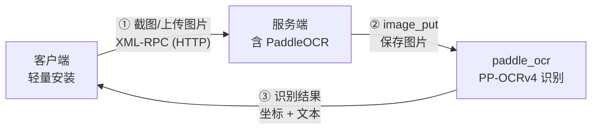

# 👁️ pdocr-rpc — PaddleOCR RPC 服务

> "服务端一次部署，客户端零成本使用，OCR 即服务。"

## 概述

`pdocr-rpc` 是基于 PaddleOCR 封装的 RPC 服务，包含客户端和服务端。通过 XML-RPC 协议将 OCR 识别能力封装为远程服务，客户端只需安装一个轻量包即可使用，无需安装庞大的 PaddlePaddle 和 PaddleOCR。

**GitHub**: [https://github.com/linuxdeepin/pdocr-rpc](https://github.com/linuxdeepin/pdocr-rpc)

**文档站**: [https://linuxdeepin.github.io/pdocr-rpc/](https://linuxdeepin.github.io/pdocr-rpc/)

**PyPI**: [https://pypi.org/project/pdocr-rpc/](https://pypi.org/project/pdocr-rpc/)

**许可证**: Apache 2.0

## 解决的痛点

- PaddleOCR 安装太重（PaddlePaddle + PaddleOCR + 模型文件），每次环境搭建费时费力
- 团队多台机器需要 OCR 能力，每台都安装一遍是重复劳动
- 测试自动化需要 OCR 定位/验证，但不想污染测试环境的依赖
- 需要跨平台 OCR（Linux X11/Wayland、Windows、macOS），统一调用方式

## 核心设计



- **服务端**：一次性安装部署 PaddleOCR，启动 RPC 服务等待客户端请求
- **客户端**：轻量安装，通过 `OCR.ocr()` 完成截图上传 → 识别 → 坐标返回
- **协议**：XML-RPC（Python 标准库 `xmlrpc`），多线程服务（`ThreadingMixIn`）

## 核心特性

### 全屏截图识别

不传参数，自动截取当前屏幕并识别所有文字，返回 `{字符串: (中心x, 中心y)}` 字典：

```python
OCR.ocr()
# {"确定": (500, 300), "取消": (600, 300), ...}
```

### 指定图片识别

```python
OCR.ocr(picture_abspath="~/Desktop/test.png")
```

### 查找字符串坐标

传入目标字符串，返回该字符串在屏幕中的中心坐标：

```python
x, y = OCR.ocr("天天向上")
# 若存在多个匹配，返回 {"天天向上": (...), "天天向上_1": (...), ...}
```

### 多语言支持

支持中文、英文、法语、德语、韩语、日语：

```python
OCR.ocr("Hello World", lang="en")
```

### 匹配度控制

调整字符串匹配的相似度阈值（0~1，默认 0.6）：

```python
OCR.ocr("目标文字", similarity=0.8)
```

### 返回模式切换

- `return_default=True`：返回 PaddleOCR 原始数据结构（四个角坐标 + 文本 + 置信度）
- `return_first=True`：多个匹配时只返回第一个

### 重试与超时

支持网络重试、重试间隔、超时和最大匹配次数配置：

```python
OCR.ocr(
    "目标文字",
    network_retry=3,      # 网络重试次数
    pause=1,              # 重试间隔（秒）
    timeout=5,            # 最大匹配超时（秒）
    max_match_number=100, # 最大匹配次数
)
```

### 跨平台截图

| 平台 | 截图方式 |
|------|---------|
| Linux X11 | `pyscreenshot` |
| Linux Wayland | KWin D-Bus (`qdbus org.kde.KWin /Screenshot`) |
| Windows | `PIL.ImageGrab` |
| macOS | `pyscreenshot` |

### 集成 funnylog

客户端集成 `funnylog` 日志框架，OCR 识别结果自动以 DEBUG 级别输出，方便调试。

## 技术栈

| 组件 | 技术 |
|------|------|
| 语言 | Python 3.6+ |
| 构建系统 | Hatchling |
| RPC 协议 | XML-RPC（Python 标准库 `xmlrpc`） |
| OCR 引擎 | PaddleOCR（PP-OCRv4） + PaddlePaddle |
| 截图 | pyscreenshot（Linux/macOS）、PIL（Windows） |
| 并发 | socketserver.ThreadingMixIn |
| 日志 | funnylog |

## 项目结构

```
pdocr-rpc/
├── pdocr_rpc/                  # 主包
│   ├── __init__.py             # OCR 客户端类（~10KB）
│   │   ├── OCR.ocr()           # 公开 API：OCR 识别 + 坐标返回
│   │   ├── OCR._ocr()          # 内部：匹配逻辑 + 坐标计算
│   │   ├── OCR._pdocr_client() # 内部：RPC 调用 + 截图
│   │   └── OCR.__init__()      # 跨平台截图 + 连通性检查
│   ├── server.py               # RPC 服务端
│   │   ├── check_connected()   # 连通性检查
│   │   ├── image_put()         # 图片接收（写入本地）
│   │   ├── paddle_ocr()        # PaddleOCR 识别调用
│   │   └── server()            # 启动多线程 XML-RPC 服务
│   ├── conf.py                 # 全局配置 _Setting
│   └── __version__.py          # 版本号
├── example.py                  # 使用示例
├── test/                       # 测试用例
├── docs/                       # 文档站源文件
├── mkdocs.yml                  # 文档站配置
├── pyproject.toml              # 项目元数据
├── ocr_utils.py                # OCR 工具函数
├── youqu_conf.py               # 有趣的配置扩展
└── publish.sh                  # PyPI 发布脚本
```

## 使用方式

### 服务端

```bash
pip install pdocr-rpc[server]
```

创建 `ocr_server.py`：

```python
from pdocr_rpc.server import server

server()  # 监听 8890 端口
```

自定义端口：

```python
from pdocr_rpc.server import server
from pdocr_rpc.conf import setting

setting.PORT = 8888
server()
```

### 客户端

```bash
pip install pdocr-rpc
```

```python
from pdocr_rpc import OCR
from pdocr_rpc.conf import setting

setting.SERVER_IP = "192.168.0.1"
setting.PORT = 8890

# 全屏识别
OCR.ocr()

# 查找指定文字坐标
x, y = OCR.ocr("天天向上")

# 指定图片识别
OCR.ocr(picture_abspath="~/Desktop/test.png")

# 多语言
OCR.ocr("Hello", lang="en")

# 调整匹配度
OCR.ocr("目标", similarity=0.8)

# 只返回第一个匹配
OCR.ocr("目标", return_first=True)
```

### 配置项

```python
from pdocr_rpc.conf import setting

setting.SERVER_IP = "127.0.0.1"   # 服务端 IP
setting.PORT = 8890               # 服务端端口
setting.NETWORK_RETRY = 1         # 网络重试次数
setting.PAUSE = 1                 # 重试间隔（秒）
setting.TIMEOUT = 5               # 超时（秒）
setting.MAX_MATCH_NUMBER = 100    # 最大匹配次数
```

## 依赖说明

| 安装方式 | 含有什么 | 包大小 |
|---------|---------|-------|
| `pip install pdocr-rpc` | OCR 客户端（pyscreenshot/pillow + funnylog） | 轻量 |
| `pip install pdocr-rpc[server]` | 客户端 + PaddlePaddle + PaddleOCR | 重量 |

## 许可证

Apache 2.0
