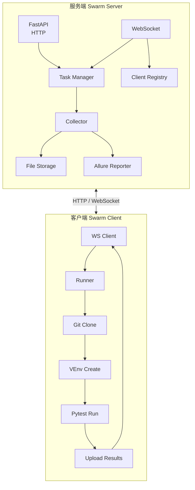

# 🐝 Swarm - 分布式自动化测试执行框架

> "让测试飞一会儿"

## 概述

Swarm 是一个**分布式自动化测试执行框架**，核心思路是：让测试用例自己找人跑，自己跑完自己报。

你可以把它理解为 `pytest-xdist` 的分布式增强版——但多了任务队列、Web 管理、Allure 自动报告、客户端心跳检测、虚拟环境自动管理。

**GitHub**: [https://github.com/mikigo/swarm](https://github.com/mikigo/swarm)

## 解决的痛点

- 测试用例跑几小时，单机扛不住全部卡死
- 几十台机器各跑各的，全靠手动分配任务
- 测试报告手动 `allure generate` 100 次，打包上传累断手
- 每次换环境，依赖安装到怀疑人生

## 核心特性

| 特性 | 说明 |
|------|------|
| 动态分发 | 客户端空闲自动领任务，无需人工干预 |
| 多客户端并发 | N 台机器并发跑，互不干扰 |
| WebSocket 实时通信 | 实时日志推送，断线自动重连 |
| Allure 报告 | 自动收集结果，一键生成 HTML 报告 |
| CLI + API 双接口 | 命令行和 REST API 双通道 |
| 心跳监控 | 客户端心跳检测，自动下线感知和任务重分配 |
| Git 代码同步 | 自动 clone/pull 测试仓库，支持分支和 tag |
| 虚拟环境管理 | 自动创建 venv 并安装依赖（支持 uv/pipenv/venv） |
| 任务队列 | 完整的任务历史、队列管理、重试、取消 |
| 零外网依赖 | 内网友好，自托管 Swagger UI 文档 |
| 终端表格 | Rich 表格展示任务列表，可自定义列、宽度、颜色 |

## 快速开始

### 安装

```bash
pip install swarm
```

### 启动服务端

```bash
# 默认端口 8000
swarm server start

# 自定义端口
swarm server start --port 9000
```

启动后可访问：
- `http://localhost:8000` — 根路径（版本信息）
- `http://localhost:8000/docs` — Swagger API 文档
- `http://localhost:8000/api/reports/{task_id}` — 查看测试报告

### 启动客户端

```bash
# 连接本机服务端
swarm client start

# 连接远程服务端
swarm client start --server http://192.168.1.100:8000
```

多台测试机器各自启动客户端即可加入集群。

### 创建并执行任务

**方式一：命令行**

```bash
swarm run tests/ --repo https://github.com/xxx/tests.git -b main

# 加过滤条件
swarm run tests/api/ -k "test_user" -m "smoke" \
    --repo https://github.com/xxx/tests.git -b main \
    --client-timeout=60 --client-reruns=2
```

**方式二：配置文件（推荐）**

```json
{
  "name": "API Regression",
  "repo_url": "https://github.com/xxx/tests.git",
  "branch": "main",
  "test_paths": ["tests/api/", "tests/integration/"],
  "filter_args": {
    "k": "api",
    "m": "regression"
  },
  "client_args": {
    "timeout": 120,
    "reruns": 2
  }
}
```

```bash
swarm run --config task.json
```

### 管理任务

```bash
swarm task list                   # 查看所有任务
swarm task list --status running  # 按状态筛选
swarm task info <task_id>         # 查看任务详情
swarm task cancel <task_id>       # 取消任务
```

## 架构概览



### 任务执行流程

1. 用户通过 CLI 或 API 创建任务 → 服务端生成任务（状态：pending）
2. 服务端 Collector 模块解析 test_paths，通过 pytest --collect-only 发现测试文件
3. 空闲客户端通过 WebSocket 发送 `next` 请求领取任务
4. 服务端将单个测试文件分配给该客户端（状态：running）
5. 客户端执行流水线：**Git Clone → 创建虚拟环境 → 安装依赖 → pytest 执行 → 上传 Allure 结果**
6. 客户端上报结果后继续请求下一个文件
7. 所有文件完成后，服务端调用 Allure CLI 生成 HTML 报告
8. 通过 API 即可访问报告

## 通信协议

### WebSocket 协议

服务端与客户端通过 WebSocket 长连接通信。

**客户端 → 服务端：**

| action | 说明 | 携带数据 |
|--------|------|----------|
| `register` | 注册客户端 | hostname, ip, os, python_version |
| `heartbeat` | 心跳保活 | — |
| `next` | 请求下一个任务 | task_id（上一个任务ID）, result |
| `log` | 推送执行日志 | message, task_id |

**服务端 → 客户端：**

| action | 说明 | 携带数据 |
|--------|------|----------|
| `registered` | 注册确认 | client_id |
| `task` | 分配任务 | task_id, test_file, repo_url, branch, client_args |
| `cancel` | 取消通知 | task_id |
| `no_task` | 无待处理任务 | message |
| `heartbeat_ack` | 心跳响应 | — |

### REST API

| 方法 | 路径 | 说明 |
|------|------|------|
| `POST` | `/api/tasks` | 创建任务 |
| `GET` | `/api/tasks` | 任务列表（支持 `?status=` 筛选） |
| `GET` | `/api/tasks/{task_id}` | 任务详情 |
| `DELETE` | `/api/tasks/{task_id}` | 取消任务 |
| `POST` | `/api/tasks/{task_id}/retry` | 重试任务 |
| `POST` | `/api/tasks/{task_id}/upload` | 上传 Allure 结果（multipart） |
| `GET` | `/api/clients` | 客户端列表 |
| `GET` | `/api/clients/{client_id}` | 客户端详情 |
| `GET` | `/api/reports/{task_id}` | 查看测试报告 |
| `GET` | `/health` | 健康检查 |

## 配置文件

### 服务端配置

通过环境变量（`SWARM_` 前缀）配置，使用 pydantic-settings：

| 配置项 | 默认值 | 环境变量 |
|--------|--------|----------|
| 监听地址 | 0.0.0.0 | SWARM_HOST |
| 端口 | 8000 | SWARM_PORT |
| Debug 模式 | False | SWARM_DEBUG |
| 数据目录 | ./data | SWARM_DATA_DIR |
| 心跳间隔 | 30s | SWARM_HEARTBEAT_INTERVAL |
| 心跳超时 | 60s | SWARM_HEARTBEAT_TIMEOUT |
| 日志保留天数 | 7 | SWARM_LOG_RETENTION_DAYS |

### CLI 配置

配置文件路径：`~/.swarm/config.yaml`（用户级）或 `./swarm.config.yaml`（项目级，优先级更高）

```yaml
task:
  list:
    columns:
      - id
      - name
      - status
      - created_at
      - duration
      - ip
      - passed
      - failed
      - report_url
    width:
      id: 36
      name: 20
      report_url: 30
    color:
      passed: green
      failed: red
      running: yellow
      pending: blue
      completed: green
      cancelled: gray
```

## 项目结构

```
swarm/
├── swarm/
│   ├── server/           # 服务端
│   │   ├── main.py      # FastAPI 应用入口
│   │   ├── api.py       # REST API 路由
│   │   ├── websocket.py # WebSocket 连接管理
│   │   ├── task.py      # 任务 CRUD 和状态管理
│   │   ├── client.py    # 客户端注册和心跳管理
│   │   ├── collector.py # 测试文件发现
│   │   ├── report.py    # Allure 报告生成
│   │   ├── models.py    # Pydantic 数据模型
│   │   └── config.py    # 服务端配置
│   ├── client/          # 客户端
│   │   ├── main.py     # 客户端 CLI 入口
│   │   ├── runner.py   # 核心执行循环
│   │   ├── git.py      # Git clone/pull 操作
│   │   ├── venv.py     # 虚拟环境管理
│   │   └── uploader.py # 结果上传
│   └── cli/            # CLI
│       ├── main.py     # Click CLI 入口
│       ├── task.py     # 任务相关命令
│       └── config.py   # CLI 配置管理
├── tests/              # 测试套件
├── docs/               # 文档
│   ├── requirements.md # 需求规格说明书
│   └── architecture.md # 架构设计文档
├── pyproject.toml     # 项目配置
└── README.md
```

## 技术栈

| 类别 | 技术 |
|------|------|
| Web 框架 | FastAPI |
| ASGI 服务 | Uvicorn |
| WebSocket | websockets |
| 数据验证 | Pydantic v2 |
| 数据设置 | pydantic-settings |
| CLI | Click |
| 终端表格 | Rich |
| HTTP 客户端 | httpx |
| 日志 | loguru |
| Git 操作 | GitPython |
| 虚拟环境 | uv / pipenv / venv |
| 测试报告 | Allure |
| 配置文件 | PyYAML |

### 开发工具链

| 类别 | 技术 |
|------|------|
| 测试框架 | pytest + pytest-asyncio |
| 代码检查 | ruff |
| 类型检查 | mypy (strict) |
| 构建系统 | setuptools |

## 测试

```bash
# 运行全部测试
pytest

# 测试覆盖
tests/
├── test_api.py        # API 端点测试（FastAPI TestClient）
├── test_task.py       # 任务管理单元测试
├── test_client.py     # 客户端模块测试
├── test_collector.py  # 测试文件发现测试
├── test_config.py     # 服务端配置测试
└── test_models.py     # Pydantic 模型测试
```

## 开发状态

版本：`0.1.0`（Alpha）

核心功能全部完成（14/16 任务），尚在积极的开发迭代中。

## License

MIT
