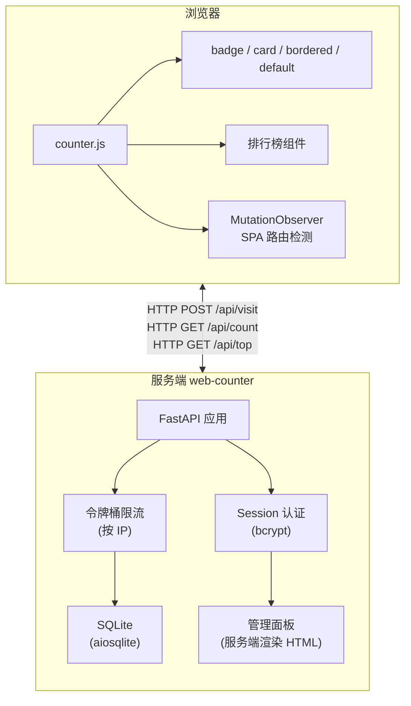

# 📊 web-counter — 自托管网站访问计数器

> "轻量、隐私优先、零配置的网站计数器。"

## 概述

`web-counter` 是一个自托管的网站访问计数器，专为静态站点（GitHub Pages、VitePress、Rspress 等）设计。通过一行 `<script>` 标签嵌入，即可为任意页面添加 PV/UV 统计，无需第三方统计服务。

后端基于 FastAPI + SQLite，前端是一个纯 JavaScript 文件。所有数据存储在自己的服务器上，不追踪用户、不存储 IP、不使用 Cookie，隐私优先。

**GitHub**: [https://github.com/mikigo/web-counter](https://github.com/mikigo/web-counter)

**PyPI**: [https://pypi.org/project/web-counter/](https://pypi.org/project/web-counter/)

**在线示例**: [https://mikigo.site](https://mikigo.site)

## 解决的痛点

- 静态站点无法统计访问量，第三方服务（Google Analytics 等）在国内访问不稳定
- 统计服务收集用户隐私数据，面临合规风险
- 接入复杂，需要注册账号、配置 SDK
- 想在自己的服务器上掌控数据，但不想搭建复杂的统计系统

## 核心特性

| 特性 | 说明 |
|------|------|
| 一行嵌入 | 在页面中插入一个 `<script>` 标签即可开始统计 |
| PV / UV 统计 | 今日 PV/UV、全站 PV/UV、单页面 PV 一应俱全 |
| 隐私优先 | SHA256(IP + salt) 匿名化，不存储 IP、不使用 Cookie |
| 多显示样式 | 支持 `badge`、`card`、`bordered`、`default` 四种样式，自动适配暗色模式 |
| 排行榜 | 内置页面浏览量排行榜组件，支持奖牌图标和进度条 |
| SPA 支持 | MutationObserver + history API 猴子补丁，自动适配客户端路由 |
| 管理面板 | Web 仪表盘，包含 30 天趋势图、排行榜、数据管理、偏移量设置 |
| 偏移量系统 | 支持设置初始计数偏移量，从其他统计工具迁移数据无缝衔接 |
| Docker 部署 | 提供 Dockerfile + docker-compose.yml，一键部署 |
| Agent Skills | 内置 Rspress / VitePress 集成指南，AI 辅助接入 |

## 快速开始

### 安装

```bash
pip install web-counter
```

### 启动服务

```bash
# 设置加密盐值（必填，用于匿名化访客 IP）
export COUNTER_SALT="your-random-salt-string"

# 启动
web-counter start
```

启动后可访问：
- `http://localhost:8000/counter.js` — 前端脚本
- `http://localhost:8000/dashboard` — 管理面板
- `http://localhost:8000/api/health` — 健康检查

### 嵌入网站

在 HTML 的 `<head>` 或 `<body>` 末尾添加：

```html
<script
  src="https://your-server.com:8000/counter.js"
  data-counter-api="https://your-server.com:8000"
  data-counter-style="badge"
  defer
></script>
```

### 显示计数器

在页面中放置带有 `data-pv-*` 属性的元素，脚本会自动填充数值：

```html
<span data-pv-today>0</span>      <!-- 今日 PV -->
<span data-uv-today>0</span>     <!-- 今日 UV -->
<span data-pv-site>0</span>      <!-- 全站 PV -->
<span data-uv-site>0</span>      <!-- 全站 UV -->
<span data-pv-page>0</span>      <!-- 当前页面 PV -->
```

### 排行榜组件

```html
<!-- 顶部 N 个页面排行榜 -->
<div data-pv-top="10"></div>

<!-- 或渲染为有序列表 -->
<ol data-pv-top="5"></ol>
```

### 创建管理员

```bash
web-counter createsuperuser
```

## 架构概览



### 数据流程

1. 用户访问页面 → `counter.js` 发送 `POST /api/visit` 到服务端
2. 服务端对访问者 IP + salt 做 SHA256 生成匿名 ID，写入 SQLite
3. `counter.js` 发送 `GET /api/count` 获取统计数值
4. 脚本查找页面中的 `data-pv-*` 元素，自动填充数值
5. 对于 SPA 应用，MutationObserver 监听到 DOM 变化或 URL 变化时自动重新统计

## REST API

| 方法 | 路径 | 说明 |
|------|------|------|
| `GET` | `/counter.js` | 前端统计脚本 |
| `GET` | `/api/health` | 健康检查 |
| `POST` | `/api/visit` | 记录访问（body: `{path, title}`） |
| `GET` | `/api/count?paths=/a,/b` | 获取统计数据 |
| `GET` | `/api/top?limit=10&exclude=/` | 页面排行榜 |
| `GET` | `/dashboard` | 管理面板（需登录） |
| `POST` | `/dashboard` | 登录表单提交 |
| `POST` | `/api/admin/login` | JSON API 登录 |
| `POST` | `/api/admin/logout` | 登出 |
| `POST` | `/api/admin/reset` | 重置数据 |
| `GET/POST` | `/api/admin/offset` | 读取/设置偏移量 |
| `GET/POST` | `/api/admin/top-exclude` | 排行榜排除规则 |

## 配置

通过环境变量或 `.env` 文件配置：

| 配置项 | 默认值 | 说明 |
|--------|--------|------|
| `COUNTER_SALT` | 必填 | IP 匿名化加密盐值 |
| `COUNTER_HOST` | 0.0.0.0 | 监听地址 |
| `COUNTER_PORT` | 8000 | 监听端口 |
| `COUNTER_DB_PATH` | ./data/counter.db | 数据库路径 |
| `COUNTER_PID_FILE` | /tmp/web-counter.pid | PID 文件路径 |
| `COUNTER_ALLOWED_ORIGINS` | * | CORS 允许的域名 |
| `COUNTER_RATE_LIMIT` | 60/min | 每 IP 每分钟最大请求数 |

## CLI 命令

```bash
web-counter start              # 后台启动服务
web-counter stop               # 停止服务
web-counter restart            # 重启服务
web-counter createsuperuser    # 创建管理员账号
web-counter export-js          # 导出 counter.js 到 stdout
```

## 项目结构

```
web-counter/
├── web_counter/
│   ├── main.py              # FastAPI 应用工厂 + 全部 HTTP 路由（247 行）
│   ├── database.py          # 异步 SQLite 操作（aiosqlite，332 行）
│   ├── dashboard.py         # 服务端渲染 HTML（登录页 + 仪表盘，362 行）
│   ├── config.py            # 配置管理（.env + 环境变量 + CLI 优先级链）
│   ├── models.py            # Pydantic v2 数据模型
│   ├── auth.py              # bcrypt 密码哈希 + 内存 Session 管理
│   ├── rate_limit.py        # 令牌桶限流器（按 IP，内存存储）
│   ├── cli.py               # CLI 入口（start/stop/restart/createsuperuser/export-js）
│   └── static/
│       └── counter.js       # 前端统计脚本（308 行）
├── skills/
│   ├── rspress-web-counter/ # Rspress 集成指南
│   └── vitepress-web-counter/ # VitePress 集成指南
├── Dockerfile               # Docker 镜像（python:3.11-slim）
├── docker-compose.yml       # Docker Compose 配置
├── DEPLOY.md                # 生产部署指南（Caddy/Nginx/systemd）
├── pyproject.toml           # 项目配置（setuptools）
└── README.md
```

## 技术栈

| 类别 | 技术 |
|------|------|
| Web 框架 | FastAPI |
| ASGI 服务 | Uvicorn |
| 数据库 | SQLite + aiosqlite（异步） |
| 数据验证 | Pydantic v2 |
| 密码哈希 | bcrypt |
| 前端 | 原生 JavaScript（零依赖） |
| 图表 | Chart.js（仪表盘 CDN 加载） |
| 构建系统 | setuptools |
| 容器化 | Docker + Docker Compose |
| Python 版本 | >= 3.8 |

## 部署

支持多种部署方式：

```bash
# Docker 部署
docker compose up -d

# 手动部署（配合 systemd 守护进程）
web-counter start
```

配合反向代理（Caddy / Nginx）即可实现同域名部署，避免跨域问题。详见 `DEPLOY.md`。

## 开发状态

版本：`0.4.2`

活跃开发中，功能持续迭代。

## License

MIT
